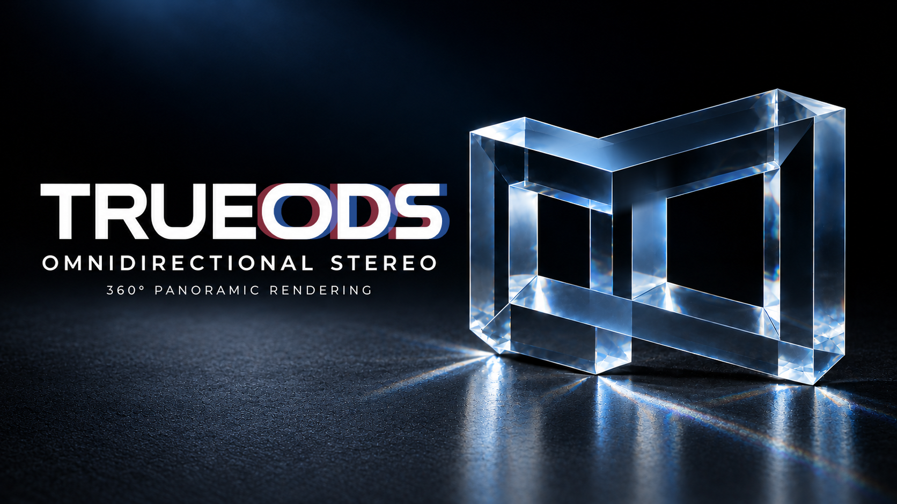
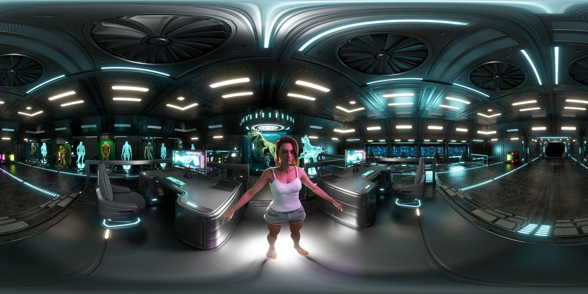
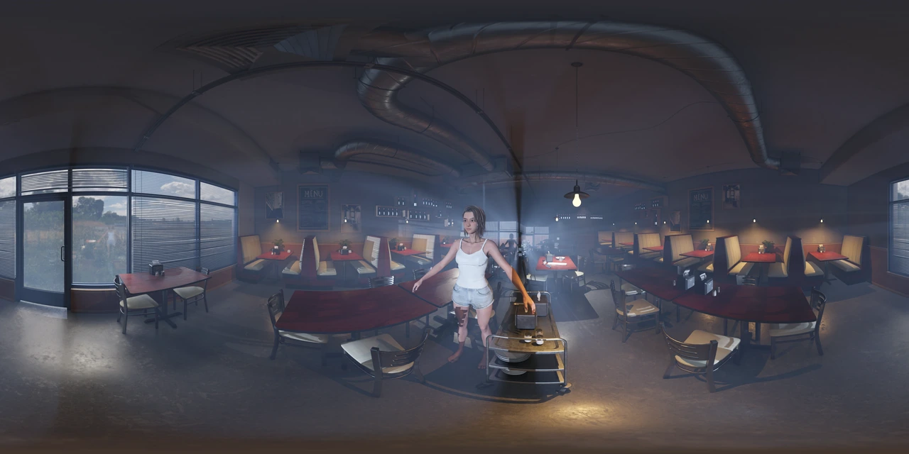
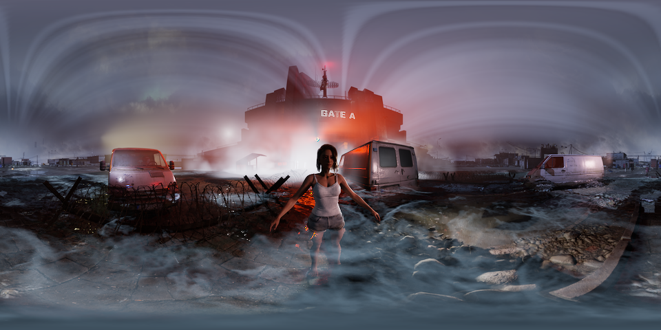



# TRUEODS
### 360° stereo with depth in every direction.

**English** · [简体中文](README.zh-CN.md)

High-resolution **360° ODS and VR180 rendering for Unreal Engine**. Create stereo image sequences in Movie Render Queue, from a single workstation to a coordinated multi-machine workflow.

[Quick start](docs/QUICKSTART.md#english) · [Standard & Pro](docs/EDITIONS.md#english) · [FAQ](docs/FAQ.md#english) · [Support](docs/SUPPORT.md#english)

> **Fab release in preparation.** Purchase links will appear here when the listings are live. Supported: **Unreal Engine 5.7 and 5.8 · Windows 64-bit · Movie Render Queue**.

## Four capabilities. Both editions.

| Capability | What it gives you |
| :--- | :--- |
| **Correct parallax with Lumen** | With Lumen, 360° stereo renders in Unreal Engine have struggled to keep binocular parallax correct in every direction. TRUEODS gets it right: depth and scale hold wherever you look. Render 360° ODS or VR180, with top/bottom or side-by-side stereo layouts. |
| **8K stereo in minutes** | One GPU renders a complete 8K left/right-eye 360° stereo frame in minutes, so high-resolution output fits everyday production. |
| **Seamless 360° volumetric fog** | Volumetric fog and light stay continuous across the full 360° panorama, indoors and outdoors: no stitching seams, and no brightness jumps, banding or other artifacts where view directions meet. |
| **Linear HDR masters** | 16-bit half-float EXR sequences for grading and compositing, alongside PNG, JPG or 16-bit TIFF review output. |

**8K stereo, defined:** a 360° panorama is **8192 × 4096 per eye**, or **8192 × 8192** in one top/bottom frame. Timing depends on the scene, settings and GPU; use a short render from your own project to estimate a full sequence.

## See the result

The previews alternate between the left and right eye. They show stereo parallax on a flat screen; use a compatible headset and player to view the final stereo panorama.

### Correct left/right-eye parallax in every direction

<!-- TRUEODS-PERF -->
Render time per 8K stereo frame (both eyes): **RTX 5090 ~47 s · RTX 4090 ~56 s** · measured on Unreal Engine 5.7 with DLAA
<!-- /TRUEODS-PERF -->

Near and distant objects shift by different amounts. Stereo depth extends around the viewing position.

### 8K stereo output in minutes

<!-- TRUEODS-PERF -->
Render time per 8K stereo frame (both eyes): **RTX 5090 ~42 s · RTX 4090 ~54 s** · measured on Unreal Engine 5.7 with DLAA
<!-- /TRUEODS-PERF -->

Fine lighting, surfaces and near-field objects in a high-resolution interior. This is a reduced preview of the stereo output.

### Seamless 360° volumetrics — interiors and exteriors

<!-- TRUEODS-PERF -->

| Interior | Exterior |
| :---: | :---: |
|  |  |
| **RTX 5090 ~47 s · RTX 4090 ~56 s** per 8K stereo frame (same scene as the first example, this view not timed separately; measured on Unreal Engine 5.7 with DLAA) | **RTX 5090 and RTX 4090 on par, about 81–82 s each** per 8K stereo frame (measured on Unreal Engine 5.7 with DLAA) |
| Light and atmosphere across the interior. | Dense atmosphere across the full panorama. |

<!-- /TRUEODS-PERF -->

<!-- TRUEODS-PERF -->
**How the times were measured:** Unreal Engine 5.7 with DLAA, 8192 × 4096 per eye, 150% supersampling, Paced memory mode, the same plugin version and settings on both machines (RTX 5090 + i9-13900KF, RTX 4090 + i7-13700KF). Each time is the average of the 10 intervals between 11 consecutive written frames, including stitching and output saving, excluding project startup and warm-up. The timed frames come from the same scenes as the previews but are not the frames shown. The exterior scene is limited mainly by render preparation on the CPU side, so the two cards are on par there. Actual times vary with scene, settings and hardware.

**Heavy-scene reference:** a confidential project whose images cannot be shown; a heavier scene rendered on Unreal Engine 5.7 with TSR (not DLAA), other settings as above. Both machines rendered the same 6 consecutive frames with the same settings (average of the 5 intervals between them): **RTX 5090 ~234 s · RTX 4090 ~304 s** per 8K stereo frame.
<!-- /TRUEODS-PERF -->

## Choose your workflow

| | **Standard** | **Pro** |
| :--- | :--- | :--- |
| Best fit | Independent creators and single-workstation production | Teams splitting long shots across multiple machines |
| All four rendering capabilities above | Included | Included |
| Resume an unfinished render | Included | Included |
| **Engine-Level Temporal Lock** | — | Consistent scene timing across rendered sections |
| **Multi-Machine Rendering** | — | Automatic configuration checks, frame-range allocation and output completeness checks |

Standard can resume unfinished jobs. Pro adds engine-level temporal continuity across separately rendered sections and resumed renders.

### Pro · Engine-Level Temporal Lock
**The frame numbers line up. The scene's motion should, too.**

Starting at the correct frame is only part of joining a shot. Time-driven scene effects also need to meet at the same point in their motion. Pro maintains that timing at the engine level when sections are rendered separately or resumed.

### Pro · Multi-Machine Rendering
**Automatic configuration checks, frame-range allocation, and output completeness checks.**

The plugin checks each machine's configuration, allocates frame ranges, and checks output completeness during collection. Deploy the project to each machine, then use the panel on each machine to start or resume its assigned work. The workflow suits several machines you manage yourself, such as studio workstations and render nodes.

[Compare editions and follow the Pro workflow →](docs/EDITIONS.md#english)

Unbaked simulations, random or externally driven effects, and lighting or effects that need several frames to settle can still need caching, warm-up and a check at each join; see the [workflow notes](docs/EDITIONS.md#english). Standard and Pro are product editions; Fab's Personal and Professional price tiers are a separate distinction.

## Start with one frame

1. Install the package matching your supported Unreal Engine version.
2. Add **True ODS Panoramic** to your Movie Render Queue job.
3. Test one 4K stereo frame, then a short sequence, before scheduling the final resolution.

[Open the complete quick start →](docs/QUICKSTART.md#english)

## Documentation & support

| Need | Go to |
| :--- | :--- |
| Installation and first render | [Quick start](docs/QUICKSTART.md#english) |
| Edition comparison and multi-machine workflow | [Standard & Pro](docs/EDITIONS.md#english) |
| Output sizes, HDR, compatibility and resuming | [FAQ](docs/FAQ.md#english) |
| Technical help | [Support guide](docs/SUPPORT.md#english) · [trueodssupport@gmail.com](mailto:trueodssupport@gmail.com) |
| Support group | [Request to join the Telegram support group](docs/COMMUNITY.md#english) · Email proof of purchase; receive an invitation link by reply |
| Availability and updates | [Release status](docs/CHANGELOG.md#english) |

This repository contains public product documentation and examples. Plugin packages are distributed separately. Demonstration scenes, characters and other third-party assets are not included with the plugin. Third-party software notices for the plugin (engine libraries such as OpenEXR and Imath, code derived from ACES and the engine's tone curve, and the optional NVIDIA DLSS plugin) are in `THIRD_PARTY_NOTICES.txt` at the root of the plugin package.

Environment credits

Thanks to **Leartes Studios** for [Coffee Shop Environment](https://www.fab.com/listings/a0c7819e-a61d-4a19-8d3b-f0f5e584e6e0), and **Tirgames Assets** for [Sci-Fi Creatures Research Lab](https://www.fab.com/listings/c2494db5-55d2-4e35-9c57-540d0f2cf455).

