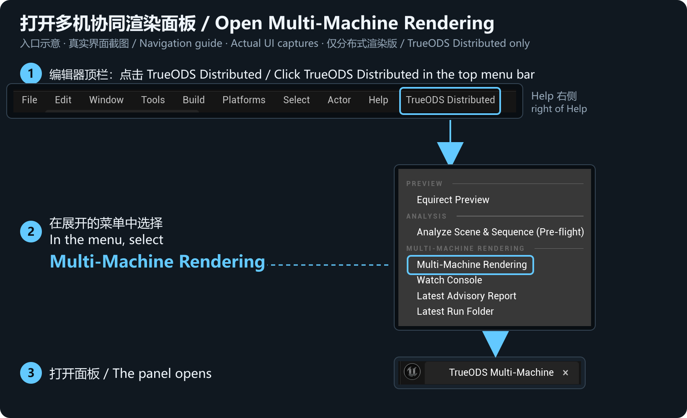
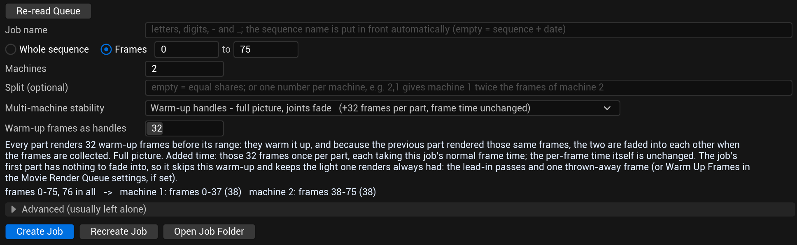

# TRUEODS Editions and Workflow

**English** · [简体中文](EDITIONS.zh-CN.md)

[Home](../README.md) · [Quick Start](QUICKSTART.md) · [FAQ](FAQ.md) · [Support](SUPPORT.md)

**The base TrueODS edition suits independent production and shots completed on one machine. TrueODS Distributed suits teams rendering parts of the same shot in parallel across several machines.** Both share the core image capabilities; TrueODS Distributed adds **Engine-Level Temporal Lock** (scene-time continuity across segments) and **Multi-Machine Rendering** (task organisation across machines).

TRUEODS is preparing for its Fab launch. This page explains edition positioning and workflow. The released listings and packages will define final features and compatibility.

### Four shared image capabilities

| Feature | Result | Where to configure |
|---|---|---|
| **Correct stereo parallax** | Stereo depth while looking around a 360° panorama for VR | MRQ > True ODS Panoramic > Stereo |
| **Fast 8K stereo rendering** | High-resolution stereo for production with shorter iteration waits; time depends on scene and hardware | Resolution / Supersample / Samples Per Pane / VRAM Mode |
| **Seamless volumetric rendering** | Continuous volumetric effects between panorama viewing directions | The same True ODS Panoramic workflow; configure volumetric effects in the scene |
| **Linear HDR masters** | EXR output retaining high dynamic range for grading and compositing | Output > Also Write EXR (HDR master) / EXR Compression |

Both editions support **height fog and volumetric fog, mesh-based volume materials, Local Fog Volumes, Volumetric Clouds, and VDB / Heterogeneous Volumes**.

Custom fog effects and particle cards for steam, rain, airborne dust and smoke are also supported.

For 360 top/bottom stereo, 8K is **8192 × 4096 per eye and 8192 × 8192 combined**. Test materials and effects on a short sequence in your scene first.

### Choose an edition

| Capability / workflow | Base edition | TrueODS Distributed |
|---|---|---|
| The four shared image capabilities | Included | Included |
| Single-machine rendering and resume after interruption | Included | Included |
| User-organised shots or frame ranges | Supported | Supported |
| **Engine-Level Temporal Lock** across segments and machines | Not included | Included |
| **Multi-Machine Rendering**: automatic configuration checks, frame-range allocation, and output completeness checks | Not included | Included |
| Typical use | Independent creators, smaller projects, single-machine shots | Production teams, long shots, several machines you manage yourself |

The base edition can resume and users can arrange frame ranges themselves. Those operations alone do not provide TrueODS Distributed's cross-machine time continuity and coordinated task workflow. For a single-machine resume, use the **Resume Render** button below the output folder in the **Output** section of **True ODS Panoramic** (it appears only when the output folder holds an unfinished render); see [Quick Start](QUICKSTART.md).

### TrueODS Distributed: Engine-Level Temporal Lock

**The frame numbers line up. The scene's motion should, too.**

For example, the first and second halves of a shot are rendered separately: on two machines, or on one machine in two runs that each start at their own first frame. The frame numbers must line up, and time-driven effects must reach the same point in time. TrueODS Distributed maintains time continuity at the engine level across segments, addressing time offsets that simply assigning frame ranges may leave unresolved.

This capability handles **continuity in scene time**; it does not guarantee that every simulation matches exactly. Unbaked simulations, random or externally driven effects, and lighting or effects that need several frames to settle still need appropriate caches, repeatable settings, warm-up, and join checks.

If the sequence has a Time Dilation track, time continuity is guaranteed only for segments that start before its first key. For a multi-machine job, enter that key's frame number in **Frames no part may start at** under **Advanced** in the **TrueODS Multi-Machine** panel (empty by default).

Temporal Lock is on by default in TrueODS Distributed and is used for segments and multi-machine jobs; you do not need to open a separate tool. It corresponds to **Consistent Motion Timing** in the job's **True ODS Panoramic** settings in MRQ. That option appears once **Rendering On Several Machines** is switched on; it is on by default, so keep it on.

### TrueODS Distributed: Multi-Machine Rendering

**Automatic configuration checks, frame-range allocation, and output completeness checks.**

This capability handles **task organisation**. Create a job in the **TrueODS Multi-Machine** panel, and the plugin allocates frame ranges by machine. Run configuration checks and start or resume the job on each machine, then bring the output together for the plugin to check frame completeness. Together with Temporal Lock, it supports rendering one shot in segments across several machines you manage yourself.

The panel checks each machine's configuration, allocates frame ranges, and checks the collected output for completeness, listing any missing frames. You copy the project to every machine, install the same engine version and plugin build on each, handle third-party resource licensing, set each machine's output location and storage, start or resume rendering on each machine, and copy the other machines' output to the host before collecting; the plugin does not connect to render-queue or farm management software. Passing a configuration check confirms the checked settings meet requirements; final images still need review.

### TrueODS Distributed multi-machine workflow

Complete the single-machine [Quick Start](QUICKSTART.md), then open **TrueODS Distributed > Multi-Machine Rendering**. You create the job on the host, save the project and copy it to the other rendering machines yourself, and collect the frames on the host at the end. On every rendering machine, you run the configuration check, then start or resume rendering that machine's assigned frames.

**Find TrueODS Distributed in the editor's top menu bar, to the right of Help.** Click it and choose **Multi-Machine Rendering** to open the **TrueODS Multi-Machine** panel tab. This entry is available in TrueODS Distributed only; in the base edition the top-level menu is named **TrueODS** and has no multi-machine entry.

These are cropped captures of the actual interface; click to view the originals. They show where to find the controls; the example ranges and values are not recommendations. Layout may vary with the installed version.

#### 1. Create the job · Host

Prepare the level, sequence, and MRQ settings. In the job's **True ODS Panoramic** settings, switch on **Rendering On Several Machines**; **Consistent Motion Timing** then appears, already on, so keep it on. In the panel, press **Re-read Queue**, enter a **Job name** (the sequence name is added in front automatically; leave it empty to use the sequence name and date), choose **Whole sequence / Frames** and **Machines**, fill in **Split (optional)** if needed, confirm **Multi-machine stability** (it has a default), then press **Create Job**. A multi-machine job writes one panorama per frame, so **Format > Projection** must be Equirectangular; with Cubemap Faces, **Create Job** rejects the job and explains why. Render cube faces on one machine.

**What to look for:** Press **Re-read Queue** first, and create the job once the panel has read the job in the queue. **Machines** is the number of rendering machines. Leave **Split (optional)** empty for equal shares, or enter one number per machine, separated by commas (for example, 2,1 gives machine 1 twice as many frames as machine 2). Under **Multi-machine stability**, the panel states what each option does to the picture and how much render time it adds; read it before creating the job. To change the job's settings later, press **Recreate Job** to rebuild the job of the same name, then copy the project to every machine again as in step 2 and repeat the step 3 check on each. **Open Job Folder** opens the job's folder.

#### 2. Save and copy · Host

Press **Save All Now** in the panel (or **File > Save All**), then copy the whole project folder yourself, including its `TrueODS\Jobs` job folder, to every other rendering machine. Every machine needs the same engine version and the same plugin build. After copying, do not save the level or the sequence on any machine, or the step 3 check will fail. Each machine's output folder is set in step 4.

#### 3. Check configuration · Every machine

Select the job in the **Job** dropdown to the left of **Rescan**, then press **Check This Machine**. If the job is not listed, press **Rescan** first. Resolve reported mismatches before rendering.

#### 4. Start or resume · Every machine

Select the local machine number. On a machine with less video memory than the host, first select a lower setting under **VRAM mode on this machine** (the picture is the same, rendering is slower). Confirm the assigned range and output location, then press **Start Rendering On This Machine**. Machines of the same class (same GPU family and amount of video memory) give the best results. By default the editor then closes by itself **without saving** unsaved changes, so this machine renders exactly the files checked in step 3 and copied to the other machines; **Resume Render Job** does the same. Two checkboxes under **Output folder on this machine** control this. If the scene needs changes after step 2, rebuild the job with **Recreate Job** instead of ticking the save option.

If a render stops, a **Resume Render Job** button appears in this step: finished parts are skipped and the stopped part continues where it stopped. A resume keeps the frames already written with complete records and renders the missing ones; it also renders the frames just before the first missing frame again and blends them, frame by frame, into the frames already on disk, so the render does not jump where it stopped. If missing frames lie between frames already written, the frames after the gap are also rendered again and blended, and the resume note does not count them. With default settings that is as many frames as the **Handle frames** shown in this step (32 by default); the resume note in this step gives the exact number. These frames take extra render time. The frames as they were before blending are kept in a `_resume_originals` folder next to the output frames.

Progress is shown in the **Watch Console** window: completed frames, the estimated finish time, and GPU usage. It opens automatically when you press **Start Rendering On This Machine**; if you close it, reopen it with **Open Watch Console** in the panel or from the menu **TrueODS Distributed > Watch Console**. The editor panel itself does not show live progress.

#### 5. Collect and review · Host

Copy the other machines' output to the host as the panel directs, then press **Collect Frames**. It gathers every machine's frames into one place, lists missing frames, and compares the frames rendered on both sides of each join. Once all frames have been collected, it applies a crossfade at each join for EXR output. If frames are missing, it skips the crossfades; fill in the missing frames, then press **Collect Frames** again. The frames replaced by blending are kept in the `dissolve_originals` folder inside the collected folder. After reviewing the missing-frame and collection reports, still play across the joins yourself to check timing, simulations, fog, and lighting.

After changing the scene, sequence, or key settings, rebuild the corresponding job with **Recreate Job**, copy the project to every machine again as in step 2, and repeat the step 3 check on each. Preserve old output and use a separate directory for new results. Determine caches and warm-up through tests on the actual shot.

### Product editions and Fab price tiers

**The base TrueODS edition and TrueODS Distributed are product editions. Fab Personal / Professional are Fab price tiers.** Select them separately. Eligibility and rights are governed by the released listing and [full Fab terms](https://www.fab.com/eula).
