# TRUEODS 快速上手 / Quick Start

[产品主页](../README.zh-CN.md) / [Home](../README.md) · [版本选择 / Editions](EDITIONS.md) · [常见问题 / FAQ](FAQ.md) · [技术支持 / Support](SUPPORT.md)

**跳转 / Jump to:** [中文](#zh) · [English](#en)

## 中文

本页按实际操作顺序编写，主线是：

**1. 安装 → 2. 添加 MRQ 设置 → 3. 理解参数并配置 → 4. 开始渲染**

- 取景预览、场景预检（第 5 节）和试渲染都是可选的，在第 4 节开始渲染之前做。
- 渲染中断后如何续渲，见第 6 节。
- TrueODS 基础版 / TrueODS Distributed（分布式渲染版）与 UE 5.7 / 5.8 的差别，见第 7 节。

**本页目录**

1. [安装](#zh-install)
2. [添加 MRQ 设置](#zh-mrq)
3. [理解参数并配置](#zh-parameters)
4. [开始渲染](#zh-render)
5. [可选工具：取景预览与场景预检](#zh-optional)
6. [续渲（基础版与分布式渲染版都支持）](#zh-resume)
7. [版本与引擎差异](#zh-differences)

**参数分区：** [Setup](#zh-setup) · [Format](#zh-format) · [Stereo](#zh-stereo) · [Resolution](#zh-resolution) · [Output](#zh-output) · [Look](#zh-look) · [Anti-Aliasing](#zh-anti-aliasing) · [Rendering](#zh-rendering) · [Render Passes / Simulation / Performance / Diagnostics](#zh-other-settings)

**关于截图**：下面的图均来自插件真实界面，点击可查看大图。

- 第 1–6 节是 UE 5.7 基础版，第 7 节是 UE 5.8 分布式渲染版，都在 Windows 上截取。
- 截图已裁剪，并遮盖私人本地路径；参数值未作改动。
- 截图里的数值是新添加 **True ODS Panoramic** 时的默认值，也就是推荐设置。

以下几处与默认值无关，图注里也会说明：

- **Manual EV100** 和 **Exposure Reference** 显示的是截图场景当时读到的曝光，每个场景都不同；
- **DLAA Status** 显示 Ready，是因为截图的电脑装了 NVIDIA DLSS 插件；没装时显示的是另一段文字（见第 7 节）；
- 设置列表里 True ODS Panoramic 那一行末尾的黄色三角，是截图工程自身的光追设置触发的 MRQ 提示（见第 2 节图注）。

适用范围：Unreal Engine 5.7 与 5.8，Windows 64 位编辑器，DX12 / SM6，Movie Render Queue（MRQ）。基础版和分布式渲染版使用同一套流程，分布式渲染版多出的部分见第 7 节。

### 1. 安装

1. 先保存工程、关闭 Unreal Editor，再安装与你的 UE 版本对应的 TRUEODS 包（Fab 为 5.7 和 5.8 分别提供安装包）。
    - 手动安装时，把完整的 `TrueODS` 文件夹放进工程的 `Plugins` 文件夹。
    - 同一个插件只保留一处安装，不要工程里一份、引擎里又一份。

2. 打开工程，在 **Edit > Plugins** 里搜索 **TrueODS**，启用插件后按提示重启编辑器。
    - 基础版在列表里的名字是 **TrueODS Panoramic**，分布式渲染版是 **TrueODS Panoramic Distributed**。
    - 它依赖的 Movie Render Pipeline、Niagara、Level Sequence Editor 插件会一起启用。

3. 重启后，菜单栏 **Help** 右边会多出 **TrueODS** 菜单（基础版；分布式渲染版显示 **TrueODS Distributed**），说明插件已经加载成功。

    [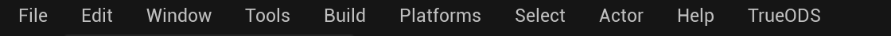](../media/guide/qs-menu-trueods.png)

    *图：UE 5.7，基础版的菜单栏。分布式渲染版这里显示 TrueODS Distributed。*

### 2. 添加 MRQ 设置

1. 打开 **Window > Cinematics > Movie Render Queue**，点 **+ Render**，选择要渲染的 Level Sequence，队列里会出现一个任务。

    [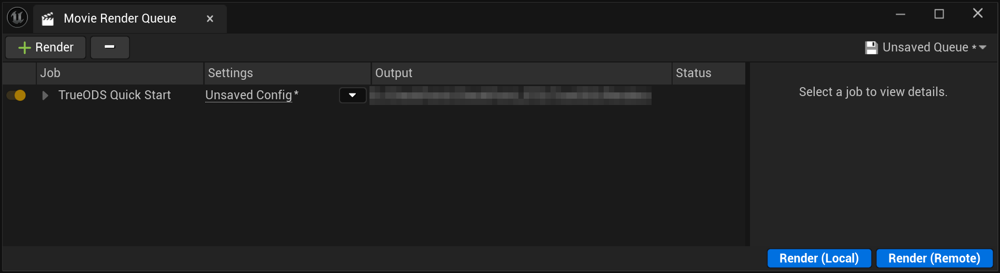](../media/guide/qs-mrq-queue.png)

    *图：MRQ 队列。点 Settings 列里的 Unsaved Config 打开任务设置；右下角的 Render (Local) 用来开始渲染（第 4 节）。截图时，任务里已经加好了 True ODS Panoramic，任务名也改过，所以 Output 列显示的是插件写入的文件夹（图中这一列是本机路径，已打码）。刚新建的任务在这里显示的是 MRQ 默认的输出目录。*

2. 点任务 **Settings** 列里的链接（新任务显示为 **Unsaved Config**），打开任务设置窗口。**这个窗口改的是任务的一份临时副本**：
    - 第 3 节的设置全部改完后，要点窗口右下角的 **Accept**，改动才会写回任务（第 4 节）；
    - 点 **Cancel** 或直接关掉窗口，改动全部作废；
    - 这个窗口开着时，MRQ 的 Render (Local) 是灰的。

3. 点窗口左上的 **+ Setting**，在 **Rendering** 类里选 **True ODS Panoramic**。它和插件列表里的 TrueODS Panoramic 是同一个插件，只是这里名字中间有空格，后面还跟着一段括号里的设置摘要。
4. **任务设置里只保留 True ODS Panoramic 和 Output 这两项。**
    - MRQ 新建任务时默认带有 **Deferred Rendering** 和 **JPG Sequence**，把它们逐个选中、按 Delete 删掉。全景的渲染和输出全部由 True ODS Panoramic 负责；插件不会检查、也不会删除其他渲染或输出项，留着它们，MRQ 可能会另外渲染并写出普通画面，白白增加时间和显存占用。
    - 如果你自己加过 MRQ 的 **Anti-aliasing** 设置项（设置列表里单独的一项，不是插件面板里的 Anti-Aliasing 区），也可以删掉。插件需要时，会在渲染开始时自动加上一个，用来做模拟预热（见 **Simulation Warmup Frames**）。全景的抗锯齿由插件面板的 Anti-Aliasing 区控制，删掉 MRQ 这一项不会关掉全景的抗锯齿。

5. **MRQ 自带的 Output 设置要保留，但不用改。** 它是设置列表里单独的一项，不要删掉；里面的关键值由插件自动填写：
    - **Output Directory**：自动写成插件面板里的输出文件夹；面板里留空时，写的是 `<工程目录>/TrueODS/Renders`。
    - **Use Custom Playback Range / Custom Start Frame / Custom End Frame**：自动写成要渲染的帧范围。开始帧会比你要的第一帧更早（下图里是 -64），这些提前的帧是插件为预热预留的（见第 3 节开头的“三种预热”），不会写成图片。
    - **Output Resolution**：渲染开始时会被插件改成 256×256。这不是全景图的尺寸，全景尺寸由插件面板决定，不用管它。
    - **File Name Format**：不用于全景文件名，全景文件名在插件面板的 Output 区设置。

    你在这里改了输出目录或帧范围，插件会马上改回去。其余各项插件不读取，也请保持 MRQ 默认值：

    - **Use Custom Frame Rate / Output Frame Rate**、**Output Frame Step**、**Handle Frame Count** 是 MRQ 自己的帧控制，改了可能让实际渲染的帧与插件面板里的帧范围对不上；
    - Output 下 **Advanced** 里的 **Frame Number Offset** 会加到全景文件的帧号上，保持 0。

    [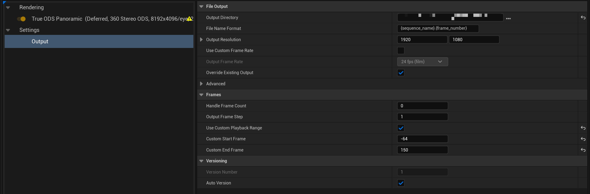](../media/guide/qs-mrq-own-output-setting.png)

    *图：左边的设置列表只剩 True ODS Panoramic 和 Output 两项；右边是选中 MRQ 自带 Output 时显示的内容。*

    - *Output Directory、Custom Start Frame（-64）、Custom End Frame 都是插件写入的，带 ↺ 标记表示已经不是 MRQ 的默认值。Output Resolution 要到渲染开始时才会被改写，所以这里还显示 1920×1080。*
    - *列表里 True ODS Panoramic 后面的黄色三角是 MRQ 的校验提示。它只在工程开着光追、却关了光追阴影时出现（截图工程正是这样），内容是光追阴影已关闭的提醒；这种情况下如果还没读取曝光，它还会提醒先按 Use Scene Exposure。你的工程里不一定会出现，它也不会阻止渲染。*

6. **注意区分两个“Output”**：
    - 一个是上面这个 **MRQ 自带的 Output 设置**，是设置列表里单独的一项，要保留，但不用改；
    - 另一个是 **插件面板里的 Output 区**，是 True ODS Panoramic 参数中的一个分组。输出文件夹、帧范围、文件名和图片格式都在这里设置，见第 3 节。

### 3. 理解参数并配置

在设置列表里选中 **True ODS Panoramic**，右侧就是插件的全部参数，下文称“插件面板”。**默认值就是推荐设置**，第一次使用时通常只需要确认两处：

- **Output** 区的输出文件夹和帧范围；
- **Look** 区的曝光。

**曝光怎么确认**：第一次打开插件面板时，插件已经按当前视口自动读了一次曝光，读到的值显示在 Look 区的 **Exposure Reference** 一行。

- 视口里的亮度就是你想要的，就不用改。
- 想以另一个方向的亮度为准，先把视口转过去，再按 Look 区的 **Use Scene Exposure**。
- 如果显示 “No viewport exposure yet…”，说明还没读到，处理方法见下面的 Look 区。

**面板里有三种“预热”，互不相干：**

1. **模拟预热**（Simulation Warmup Frames）：出图前先让粒子、天气等模拟跑一段，不出图。
2. **画面预热**（Warm Up Before First Frame / Warm Up Frames）：先渲染若干帧再丢掉，让雾、体积光、间接光在第一张成品里就已经稳定。
3. **预热视图**（Warm-up Pages / Warm View Resolution Cap）：只和显存占用有关，不影响画面。

MRQ Output 里提前的那 64 帧，就是为第 2、3 种预留的。

下面按插件面板从上到下的顺序，说明每一项控制什么、默认值是多少、什么时候需要改，以及改了会影响画质、速度还是显存。

- 灰色的项表示在当前设置下不起作用。
- 只在特定条件下才出现的项，会写明出现条件。
- 没有出现在面板上的隐藏项和实验项，这里不介绍。

[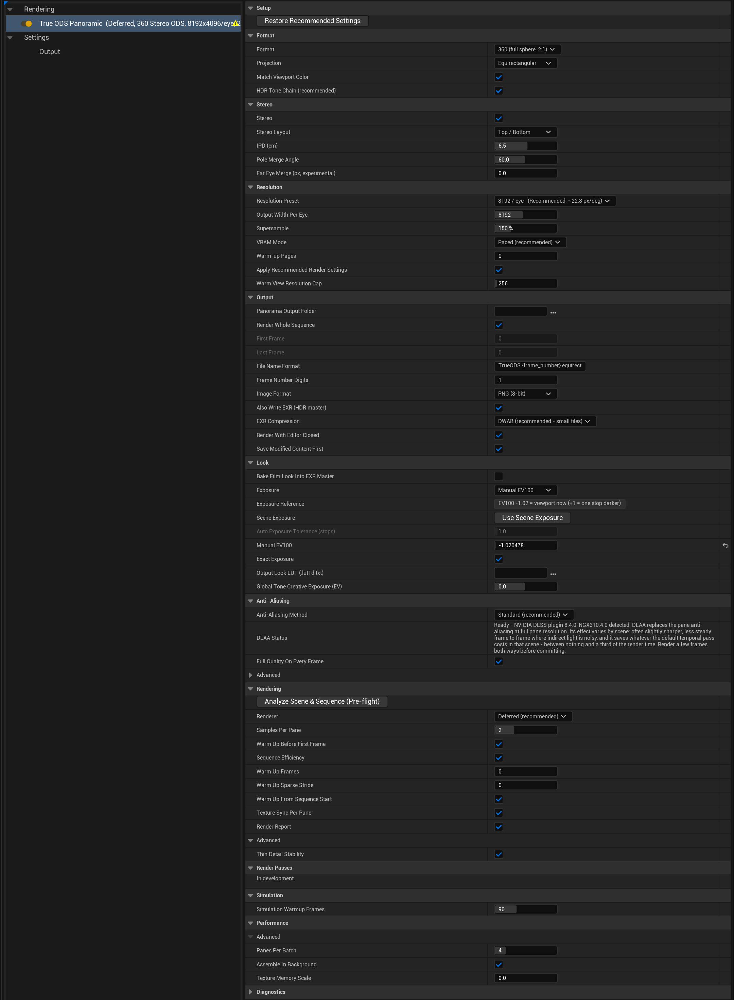](../media/guide/qs-panel-overview.png)

*图：插件面板整页，从 Setup 到 Diagnostics，均为默认值。*

- *Rendering 区和 Performance 区下方的 Advanced 在截图里是展开的；Anti-Aliasing 区的 Advanced 和 Diagnostics 区是折叠的。*
- *Manual EV100 和 Exposure Reference 显示的是截图场景读到的曝光。*
- *黄色三角的含义见第 2 节图注。*
- *下面按分区展示，逐一说明。*

#### Setup

[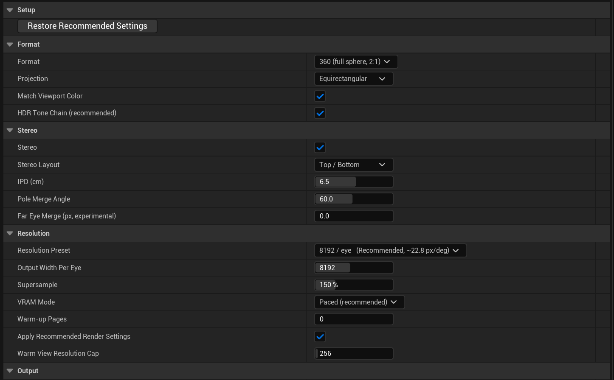](../media/guide/qs-panel-1-setup-format-stereo-resolution.png)

*图：Setup、Format、Stereo、Resolution 区，均为默认值。*

- **Restore Recommended Settings**（按钮）：把插件的设置恢复成推荐值。
    - **不会**恢复的：输出文件夹、文件名格式、帧号位数、Render Whole Sequence 和帧范围、Look LUT、已经读到的曝光值；分布式渲染版另外保留 Require This Checksum。
    - 设置改乱了，或者沿用了旧预设时，按一下即可；按错了可以用撤销（Ctrl+Z）恢复。

#### Format

- **Format**（默认 **360 (full sphere, 2:1)**）：输出完整的 360° 球面，或者只输出前半球 **180 (front hemisphere)**。
    - 选 180 并使用分辨率预设时，每眼是正方形，例如 8192 预设输出每眼 4096×4096。选 180 时建议同时把 Stereo 区的 Stereo Layout 改成 Side by Side。
    - 选 180 时，插件只渲染前半球需要的那一半画面，每帧耗时约为 360 的一半，输出的图也变小。

- **Projection**（默认 **Equirectangular**）：
    - **Equirectangular**：VR 头显和 360 播放器通用的等距柱状投影，每眼一张图。
    - **Cubemap Faces**：改为输出立方体的各个面，每个面一张单独的图（360 是 6 个面，180 是 5 个面），单眼、双眼都可以用。立方体面按单独的规则命名和写出，不走 Output 区的文件名和图片格式设置；需要时请先小范围试渲，确认输出符合你的流程。选 Cubemap Faces 后，下面的 HDR Tone Chain 会隐藏。

- **Match Viewport Color**（默认开）：开着时，全景图使用场景自己的色调映射和后期颜色，与视口里看到的一致；关掉会改用旧版固定的胶片曲线。影响颜色，一般不需要关。
- **HDR Tone Chain (recommended)**（默认开；只在 Format 为 360 或 180、Projection 为 Equirectangular、并且 Renderer 为 Deferred 时出现）：
    - 开着时，整张全景先以 HDR 拼好，再统一做一次色调映射。EXR 是真正的线性母版，调色时按 Linear 输入处理；PNG / JPG / TIFF 带有最终的画面效果。
    - 关掉会退回旧的 8 位处理方式，EXR 不再是场景线性的。
    - 建议保持开启。开启时显存占用可能略高一点。

#### Stereo

- **Stereo**（默认开）：双眼立体。关掉输出单眼全景，需要渲染的眼睛数减半，渲染时间大约也减半。
- **Stereo Layout**（默认 **Top / Bottom**，只在 Stereo 开启时出现）：只决定两只眼睛在图里怎么排列，不影响画质和速度。
    - **360 推荐上下排列（Top / Bottom）**：8192 设置下整图是 8192×8192（每眼 8192×4096）；
    - **180 推荐左右排列（Side by Side）**：8192 设置下整图是 8192×4096（每眼 4096×4096）。默认是上下排列，选 180 时请手动改成 Side by Side。

    播放器或后期流程另有要求时，按它们的要求选择。

- **IPD (cm)**（默认 6.5，只在 Stereo 开启时出现）：两眼间距，决定立体感的强弱。数值越大立体感越强，近处的物体也越容易让人看着不舒服。不影响速度。
- **Pole Merge Angle**（默认 60，只在 Stereo 开启时出现）：从这个纬度开始，双眼画面逐渐合并成单眼，到正上方和正下方时完全合并，因为在头显里抬头或低头时看到全立体会不舒服。设为 90 表示不合并。只影响观看舒适度。
- **Far Eye Merge (px, experimental)**（默认 0 = 关，只在 Stereo 开启时出现）：实验项，保持 0 即可。
    - 数值是一个远近门槛，单位是输出图上的像素：左右眼画面错位不超过这么多像素的远处内容，两只眼睛使用同一份画面，远景在两眼之间更一致。
    - 以每眼 8192、IPD 6.5 cm 为例（水平方向，粗略换算）：1 约对应 85 米以外，2 约 42 米以外，4 约 21 米以外，8 约 11 米以外。
    - 代价：被合并的远处区域里，水面、玻璃和反射的立体深度会出错；每帧的渲染时间和显存也会增加。
    - 只对 Equirectangular 输出起作用。

#### Resolution

- **Resolution Preset**（默认 **8192 / eye (Recommended, ~22.8 px/deg)**）：每眼的输出宽度，可选 4096、6144、8192、12288、16384，也可以手动填。分辨率越高画面越清楚，渲染时间大致随像素数量增加，显存占用也越高。
- **Output Width Per Eye**（默认 8192）：每眼宽度的实际数值。
    - 选了预设会自动填好；手动改这里时，预设会变成 **Custom (manual)**，这是正常的。
    - 360 的高度是宽度的一半，180 的高度与宽度相同。

- **Supersample**（默认 150%）：先按更高的内部分辨率渲染，再缩小输出。数值越高边缘越干净，但渲染越慢、显存占用越高。
- **VRAM Mode**（默认 **Paced (recommended)**）：控制插件怎样把渲染压在显存范围内。**所有档位的画面完全相同**，贴图始终完整加载，只影响临时显存和速度。
    - 什么时候改：渲染因为显存不足而失败，或者较重的帧突然慢了好几倍（显卡开始借用内存）时，往下调一档再渲。
    - **Tiled 2x2 / 3x3 / 4x4**：峰值临时显存约降到 1/4、1/9、1/16。渲染会明显变慢，设置说明给出的估计是约为原来的 4、9、16 倍。
    - 怎么选（设置说明给出的参考）：
        - 24 GB 及以上的显卡渲 8K，或 12–16 GB 的显卡渲 4K，用 Paced；
        - 12–16 GB 的显卡渲 8K，用 Tiled 2x2；
        - 8–12 GB 的显卡，用 3x3 到 4x4。

    - **Normal**：不做任何显存管理，只适合显存很宽裕的情况。

- **Warm-up Pages**（默认 0 = 自动：VRAM Mode 为 Normal、Paced 或 Tiled 2x2 时是 4，Tiled 3x3 是 9，Tiled 4x4 是 16）：降低渲染开始阶段的显存峰值，几乎不增加时间。
    - 数值越大，这一阶段的显存峰值越低，MRQ Output 里的开始帧也会更早，这是正常的。
    - Paced 仍然显存不足、而 Tiled 又太慢时，可以把这里调大试试，例如 8（最大 16）。Paced 下自动已经是 4，填 4 不会有变化。

- **Apply Recommended Render Settings**（默认开）：渲染期间自动套用全景需要的一组引擎渲染设置，渲染结束后恢复原样，工程本身不会被修改。这组设置包括：
    - 关闭运动模糊；
    - 去掉物体相接处的暗边（不是镜头暗角）；
    - 调整阴影清晰度和光追阴影采样；
    - 加强贴图加载。

    只有当其中某一项和你的场景冲突时才关掉。关掉后下方会出现以下六项供手动设置：

    - **Disable Motion Blur**
    - **Remove Dark Halos**：去掉物体与物体、墙面、地面相接处出现的暗边暗晕，不是镜头暗角；间接光会略少一点细节
    - **Sun Shadow Sharpness**
    - **Lamp Shadow Sharpness**
    - **RT Shadow Samples Per Pixel**
    - **Boost Texture Streaming**

    注意：关掉后，插件仍会按这里的数值写入阴影清晰度和光追阴影采样，不会改用工程自己的设置；阴影清晰度填 0 也会按 0 写入（设置里的提示说 0 会保留工程设置，与实际不符）。阴影越清晰、采样越多，速度越慢、显存占用越高。

- **Warm View Resolution Cap**（默认 256）：降低高分辨率输出时的显存峰值。设 0 表示不限制，显存占用最高。它不影响画面，保持默认即可。

#### Output（插件面板里的 Output 区）

[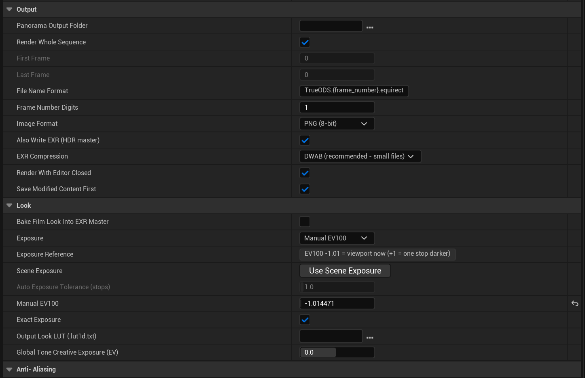](../media/guide/qs-panel-2-output-look.png)

*图：Output 区和 Look 区，均为默认值。Manual EV100 和 Exposure Reference 显示的是截图场景当时读到的曝光，与默认值无关。*

- **Panorama Output Folder**（默认留空）：成品帧写到哪里。
    - 留空时写到 `<工程目录>/TrueODS/Renders`（设置里的提示文字写的是 Saved/TrueODS，以实际位置为准）。
    - 建议每个任务选一个新的空文件夹，因为续渲是按这个文件夹里的记录判断的（第 6 节）。
    - 这个文件夹里有一次没渲完的渲染时，下方会出现续渲提示和 **Resume Render** 按钮，见第 6 节。

- **Render Whole Sequence**（默认开）：渲染整个 Level Sequence。只想渲其中一段时，关掉它，再填下面两项。预热需要的前置帧插件会自动安排，MRQ 自带的 Output 不用动。
- **First Frame / Last Frame**（默认 0 / 0）：要写出的第一帧和最后一帧，用的是序列帧号，两端都包含。Render Whole Sequence 开着时这两项是灰的。
- **File Name Format**（默认 `TrueODS.{frame_number}.equirect`）：每帧的文件名，不含扩展名。可以使用 MRQ 的占位符，例如 `{sequence_name}`、`{map_name}`、`{date}`；名字里没有帧号时，插件会自动加在末尾。
- **Frame Number Digits**（默认 1，也就是不补零，文件名为 0、1、2 …）：帧号至少写成几位，位数不够的在前面补零。有些剪辑软件要求每帧的位数相同才能识别成图片序列，这时按最长的序列设成 4 或更多。
- **Image Format**（默认 **PNG (8-bit)**）：每帧写出的可直接查看的图片。全景不使用 MRQ 自带的输出格式设置，格式只在这里选。可选：
    - **PNG**：无损，8 位；
    - **JPG**：文件小，质量 95；
    - **TIFF**：16 位、不压缩，文件很大；
    - **None (EXR master only)**：只写 EXR。

- **Also Write EXR (HDR master)**（默认开）：另外写一份线性、未调色的 HDR 母版 `.exr`。要调色时用它；旁边的 PNG / JPG / TIFF 只是按预设画面效果转出的一个版本。
- **EXR Compression**（默认 **DWAB**，只在写 EXR 时出现）：DWAB 文件小，按常规曝光调色看不出损失，但它是有损压缩。需要无损时选 ZIP 或 PIZ，文件会大好几倍；None 更大。
- **Render With Editor Closed**（默认开）：开始渲染后编辑器会关闭，由一个后台进程继续渲染，同时打开进度窗口。
    - 这样做是为了省内存：大场景加高分辨率时，编辑器自己占用的那部分内存最容易把机器撑爆。
    - 画面与在编辑器里渲染完全相同。
    - 因为编辑器会关闭，开始前要把设置都确认好。关掉此项则在编辑器里正常渲染。

- **Save Modified Content First**（默认开，只在 Render With Editor Closed 开启时出现）：关闭编辑器前是否先保存修改过的关卡和资产。
    - 开着时**直接保存，不再询问**；关掉则不保存直接关闭，未保存的修改会丢失。
    - **如果保存失败，渲染不会开始**：编辑器会留在原处，Output Log 里出现 `[TrueODS][EDITOR_CLOSED] saving modified content FAILED`。这时先手动保存并处理保存失败的原因，或者确认可以丢弃这些修改后关掉此项，再重新开始渲染。

#### Look

- **Bake Film Look Into EXR Master**（默认关）：关着时，EXR 母版保留完整的高光范围，方便后期调色；打开会把胶片曲线烘进 EXR，亮部被压平，之后调色无法恢复。只有场景不加这条曲线就明显不对时才打开。
- **Exposure**（默认 **Manual EV100**）：全景的亮度来源。可选：
    - **Auto**：用镜头相机自己的曝光，同时测量场景，两者相差超过 Auto Exposure Tolerance 时改用测量值，并在日志里写明用了哪个；
    - **Match Viewport**：锁定为你此刻在编辑器视口里看到的曝光；
    - **Camera / Scene**：始终使用相机或后期处理体积自身的曝光；
    - **Neutral Auto Meter**：始终重新测光，忽略场景的曝光设置；
    - **Manual EV100**：使用下面填写的固定值。

    下拉列表里 Auto 标着 “recommended”，但当前版本的实际默认值是 Manual EV100，并会自动读取场景曝光，见下面两项。

- **Exposure Reference**（只读）：显示本次打开面板后读到的视口曝光，例如 “EV100 -1.01 = viewport now (+1 = one stop darker)”。重新打开面板后这一行可能是空的，这不代表曝光丢了，Manual EV100 里的数值仍然有效。
- **Scene Exposure → Use Scene Exposure**（按钮）：从当前透视视口读取曝光，填进 Manual EV100，不需要先渲染。
    - 读取前，先把视口转到你希望以之为曝光依据的方向。
    - 按完后看一眼 Exposure Reference：如果显示 “No viewport exposure yet…”，说明还没读到，先在视口里点一下让它渲染一帧，再按一次。
    - 第一次打开面板时，如果 Exposure 是 Manual EV100 且还没读过，插件会自动读一次，所以截图里 Manual EV100 显示的是截图场景的数值。

- **Auto Exposure Tolerance (stops)**（默认 1.0）：只在 Exposure 为 Auto 时起作用，其他时候是灰的。它规定相机曝光与测量值相差多少档以内时仍信任相机的值。刻意做的偏暗或偏亮风格被 Auto 改掉时，把它调大。
- **Manual EV100**（只在 Exposure 为 Manual EV100 时出现）：固定的曝光值，数值越小画面越亮，+1 表示暗一档。
    - 这是插件自己的刻度，不会再叠加场景里的 Exposure Compensation，所以不要直接照抄相机后期设置里的数。
    - 一般用上面的按钮读取，而不是手填。

- **Exact Exposure**（默认开）：让成品帧准确落在上面设定的曝光上。代价是任务开始时多花一点时间，只花一次，不影响每帧的速度。建议保持开启。
- **Output Look LUT (.lut1d.txt)**（默认留空，即使用插件自带的 LUT）：只作用于 PNG / JPG / TIFF，**永远不会**作用于 EXR。想用自己的风格 LUT 时，在这里指定文件路径。
- **Global Tone Creative Exposure (EV)**（默认 0，在 HDR Tone Chain 勾选时出现）：只调整 PNG / JPG / TIFF 的整体亮度，单位是档，**+1 表示亮一档**，方向与 Manual EV100 相反。
    - EXR 母版的像素不受影响，这个数值只记在 EXR 文件头里。
    - 选 Cubemap Faces 或 Path Tracing 时，HDR Tone Chain 那一行被隐藏，但这一行仍会显示，此时不起作用。

#### Anti-Aliasing

[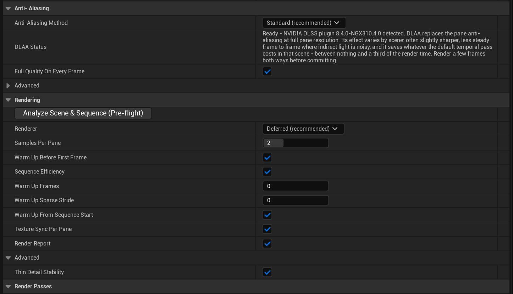](../media/guide/qs-panel-3-antialiasing-rendering.png)

*图：Anti-Aliasing 区和 Rendering 区，均为默认值。*

- *DLAA Status 显示 Ready，是因为截图的电脑装了 NVIDIA DLSS 插件。*
- *Anti-Aliasing 区的 Advanced 是折叠的，展开后只有 Near Clip Distance (cm) 一项；Rendering 区的 Advanced 在截图里是展开的。*

- **Anti-Aliasing Method**（默认 **Standard (recommended)**，只在 Renderer 为 Deferred 时出现）：
    - **Standard**：高光和间接光稳定，画面与视口一致；
    - **Alternative**：稍微多一点噪点，偶尔对快速运动更友好；
    - **DLAA**：需要安装经过验证的 NVIDIA DLSS 插件，没有时这一项是灰的，鼠标悬停可以看到原因；
    - **Off**：最快，但高光和间接光会在帧与帧之间闪烁。

    已经选了 DLAA 却没有可用的 DLSS 时，渲染会自动改用 Standard，并只在日志里留一条警告。

- **DLAA Status**（只读）：显示 DLAA 当前能不能用，以及不能用的原因。
- **Full Quality On Every Frame**（默认开，只在 Deferred 时出现）：让每一帧都达到第一帧的完整质量。Samples Per Pane 为 2 或以上时，这会多花一些时间。关掉后第一帧之后的帧会快一些，但体积雾灯光附近可能出现方形光晕。
- **Advanced > Near Clip Distance (cm)**（默认 0）：离相机多近的东西仍然会被画出来。0 表示几乎全部保留（实际按 1 cm 处理），几乎所有镜头都适用。只有贴着镜头的物体（例如肩膀、镜头前的道具）需要从全景里去掉时才调大。

#### Rendering

- **Analyze Scene & Sequence (Pre-flight)**（按钮）：场景预检，见第 5 节。注意：从这个按钮运行时**不会检查序列**，要连同序列一起检查，请用菜单栏里的同名入口。
- **Renderer**（默认 **Deferred (recommended)**）：
    - **Deferred**：速度快，几乎所有任务都用它。
    - **Path Tracing**：光照和反射可以作为参考级质量，但每帧要几小时而不是几分钟；需要工程里已经启用 Path Tracing，否则任务会停止。

    两种渲染器的立体效果都正确。选 Path Tracing 后，以下各项会隐藏：

    - Samples Per Pane、Thin Detail Stability；
    - Warm Up Before First Frame，以及它下面的 Warm Up Frames / Warm Up Sparse Stride / Warm Up Full Frames；
    - Anti-Aliasing Method、Full Quality On Every Frame、HDR Tone Chain。

    Warm Up From Sequence Start、Sequence Efficiency 和 DLAA Status 仍然显示。同时会出现两项新设置：

    - **Path Tracing Samples Per Pane**（默认 64）：采样数越多，噪点越少，时间大致按比例增加；
    - **Path Tracing Denoiser**（默认 Project）：是否降噪。

- **Samples Per Pane**（默认 2，只在 Deferred 时出现）：采样次数。
    - 2 能让头发、电线、栏杆、植被这类细小的东西保持干净，Thin Detail Stability 也需要它。
    - 场景里没有细小物体时，1 更快，画面看起来一样。
    - 渲染时间会随次数增加，但增加的幅度小于次数的倍数。

- **Warm Up Before First Frame**（默认开，只在 Deferred 时出现）：开头先渲染并丢弃最多 Warm Up Frames 帧，让写出的第一帧与后面的帧看起来一致，这一点在雾、体积光和间接光上最明显。续渲时的平滑衔接也靠这一项（第 6 节）。
    - 用来预热的是范围开头之前的序列帧，前面有几帧就只能用几帧。
    - 默认渲整段序列时，范围正好从序列第一帧开始，前面没有帧可用：这时不花预热时间，但写出的第一帧可能与后面略有不同。
    - 在意这一帧时，可以在 Sequencer 里把序列的播放范围往前延长（最多 Warm Up Frames 那么多帧），让范围开头之前有足够的帧。

- **Sequence Efficiency**（默认开）：连续渲染多帧时更快，画面不变。只渲一帧时开关都一样。
- **Warm Up Frames**（默认 0 = 32 帧，只在 Warm Up Before First Frame 开启、且 Renderer 为 Deferred 时出现）：写出第一帧之前，最多先渲染再丢弃的帧数。每一帧都要花一帧的渲染时间。
- **Warm Up Sparse Stride**（默认 0 = 关，出现条件与 Warm Up Frames 相同）：让画面预热更省时，数值越大越省时，至少 2 才起作用。写出的帧不受影响。
- **Warm Up Full Frames**（默认 4，在上述条件下、且 Warm Up Sparse Stride 大于 0 时出现）：Warm Up Sparse Stride 生效时，预热的最后几帧仍按完整质量渲染。
- **Warm Up From Sequence Start**（默认开）：先从序列第一帧一直播放到渲染范围开头，让随时间累积的效果（例如烟雾慢慢充满房间、越积越多的泡沫）和连续渲染时一样。代价是范围之前的每个序列帧大约 0.5 秒；范围从序列第一帧开始时没有额外代价。
- **Texture Sync Per Pane**（默认开）：防止偶尔有一块贴图以低分辨率、发糊的状态被渲进画面。这个问题时有时无，试渲一次没出问题不代表可以关。代价很小，保持开启。
- **Render Report**（默认开）：在输出文件夹的 `_metadata` 里写一份报告 `trueods_advisory.md`（另有 `.jsonl`），只记录、不修改场景，不花渲染时间。内容包括：
    - 场景里布料和毛发组件的数量；
    - 每次渲染结果可能不同的模拟（这一段的标题是 “Cross-machine consistency”，单机渲染也会出现）；
    - 每一帧的贴图同步加载次数，以及哪些方向的贴图加载迟了、那一块可能发糊。

    显存不足的提示不在这份报告里，只出现在日志和进度提示中。

- **Advanced > Thin Detail Stability**（默认开，只在 Deferred 且 Samples Per Pane 大于 1 时出现）：去掉细小物体的闪烁和爬行。
    - 代价是离相机很近的物体可能出现淡淡的重影，表面细节略软。
    - 哪种更好取决于镜头，拿不准时两种各渲一帧对比。
    - 不花额外时间。

#### Render Passes、Simulation、Performance、Diagnostics

[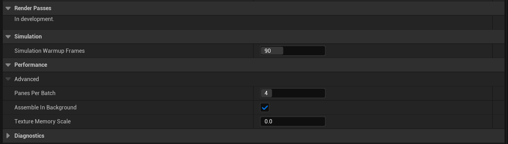](../media/guide/qs-panel-4-passes-simulation-performance-diagnostics.png)

*图：Render Passes、Simulation、Performance、Diagnostics 区，均为默认值。Performance 区的 Advanced 在截图里是展开的，Diagnostics 区是折叠的。*

- **Render Passes**：目前只显示 “In development.”，是尚未提供的功能，没有可设置的内容。
- **Simulation Warmup Frames**（默认 90）：写出第一帧之前先模拟多少帧。
    - 粒子、天气、飘落物这类动态效果在离线渲染开始时是空的，需要模拟一段时间才会达到平时在屏幕上的样子。
    - 每个任务只模拟一次，所以连续的帧范围仍然是连续的。
    - 静态场景可以设为 0，这样最快。

- **Performance > Advanced**：
    - **Panes Per Batch**（默认 4）：4 最快；只有显卡驱动变得不稳定时才调低。任何值的画面都一样。
    - **Assemble In Background**（默认开）：在渲染下一帧的同时拼接上一帧，节省时间，结果相同。
    - **Texture Memory Scale**（默认 0 = 自动）：只有渲染过程中表面一直发糊、或细节明显来回切换时，才手动调高，代价是占用更多显存。

- **Diagnostics > Advanced**：**Dump GPU Memory Per Frame**、**Log Texture Memory Each Frame** 默认都是关的。它们是排查问题用的，会让日志变得非常大，平时保持关闭。

### 4. 开始渲染

0. **（可选）点 Render 之前：**
    - 想先看取景或做场景预检，就在这时做，见第 5 节。
    - 场景比较复杂时，可以先关掉 **Render Whole Sequence**，只渲几帧，检查曝光、接缝、细线和双眼视差；有显存顾虑时，也可以顺便观察峰值显存和每帧耗时。注意：默认设置下，试渲染同样会关闭编辑器，而重新打开工程后 MRQ 队列是空的。所以试渲染前请先按下一步存好预设，或者试渲染时暂时关掉 Render With Editor Closed。
    - 这些都不是必需的。

1. **建议先存一份预设**：在任务设置窗口顶部的预设按钮（新任务显示为 **Unsaved Config**）里选 **Save As Preset**，保存到工程里。重新打开工程后队列是空的，这份预设可以把设置找回来。（续渲不需要预设：插件会把设置随帧保存，见第 6 节。）
2. 在任务设置窗口右下角点 **Accept**，窗口会关闭，设置写回任务。
3. 在 MRQ 窗口点右下角的 **Render (Local)**。默认设置下会依次发生：
    1. 所有修改过的关卡和资产**直接保存，不再询问**（Save Modified Content First）；
    2. 编辑器关闭，由后台进程渲染；
    3. 打开进度窗口。

    渲染完成后编辑器不会自动重新打开，需要时自己打开工程。

4. 渲染结束后，输出文件夹里有：
    - 每帧一张 PNG 和一个 EXR，默认文件名是 `TrueODS.0.equirect.png` / `TrueODS.0.equirect.exr`，依此类推。360 上下双眼的 8192 设置下，整图是 8192×8192（每眼 8192×4096）；
    - `_metadata` 文件夹：进度记录、逐帧记录和这次任务的设置副本（续渲要用），以及 Render Report 生成的 `trueods_advisory.md`；
    - `TrueODS_render_report.txt`：后台渲染跑到最后一帧时写出的简短结果（帧数、耗时、实际使用的曝光），插件还会尝试在一个窗口里显示它。

    用支持对应排列方式（例如上下排列）的立体 360 播放器或 VR 头显查看。

### 5. 渲染前的可选工具：取景预览与场景预检

#### Equirect Preview（取景预览）

**它做什么**：在编辑器里实时显示相机周围一整圈的全景画面，包括身后、头顶和脚下，用来在渲染前检查取景。

**怎么打开**：菜单栏 **TrueODS**（分布式渲染版为 **TrueODS Distributed**）**> Preview > Equirect Preview**，会弹出一个名为 **TrueODS Preview** 的独立窗口。也可以在控制台输入 `TrueODS.OpenPreview` 打开。两个版本、两个引擎版本都有这个功能。

[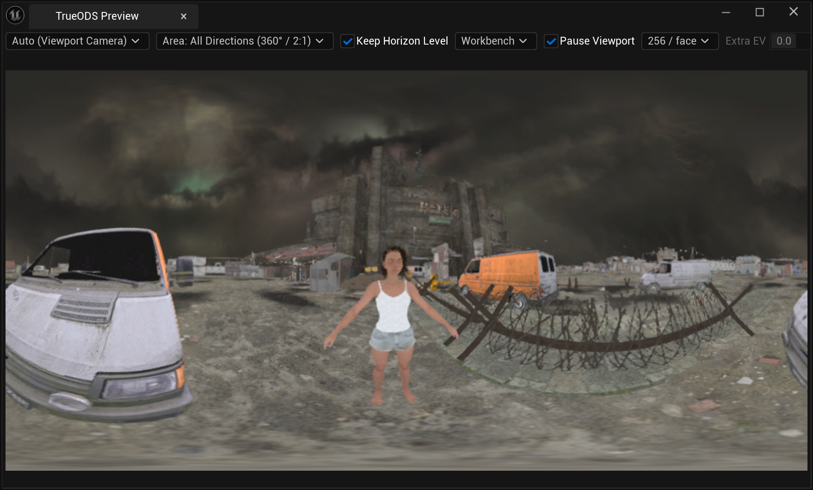](../media/guide/qs-equirect-preview.png)

*图：Equirect Preview 窗口，默认设置，跟随关卡视口，显示 360° 全景。*

**它不是什么**：

- 它是单眼、低分辨率的取景预览，不是成片的样张。
- 它不读取 True ODS Panoramic 里的任何设置（格式、双眼、分辨率、曝光、Look LUT 都不管），所以画面细节和亮度都会与最终渲染不同。
- 它不会往场景里添加任何东西，也不会修改关卡。

**窗口里的选项**（从左到右）：

- **Source**（默认 **Auto (Viewport Camera)**）：跟随关卡视口。视口锁定到 Sequencer 镜头时，预览跟随镜头相机，拖动时间轴时画面随之变化。下拉列表里可以选关卡中的任意相机，预览就固定在那台相机上（显示为 “Pinned: 相机名”）。
- **Area**（默认 **All Directions (360° / 2:1)**）：显示完整的 360°；选 **Front Half Only (180° / Square 1:1)** 时，只显示相机朝向的前半球，用来检查 180 画面里包含哪些内容。它只影响预览，不影响渲染输出。
- **Keep Horizon Level**（默认开）：画面保持水平，只跟随相机的左右转向，这和最终渲染一致。关掉后会跟随相机的俯仰和侧倾，最终渲染不会这样。
- **显示模式**（默认 **Workbench**）：
    - **Workbench**：只显示物体表面的颜色，没有光照，动画实时更新，最快；不显示雾、云，以及玻璃、水这类半透明表面。
    - **Viewport Unlit**：无光照的效果，动画实时更新；不显示雾和云。
    - **Fast (No Dynamic Shadows)**：有光照，但没有阴影、反射、体积雾、云等效果。
    - **Quality**：完整光照，最接近最终画面，也最慢。

    Fast 和 Quality 在播放或移动相机时保持上一张画面，停下来后才刷新。

- **Pause Viewport**（默认开）：预览打开期间暂停关卡视口的持续刷新，节省显卡。你在视口里操作时它仍会刷新，关掉预览后自动恢复。
- **分辨率**（默认 **256 / face**，可选 256、512、1024）：数值越大，预览越清楚，占用的显卡资源也越多。
- **Extra EV**（默认 0）：在场景自身曝光的基础上调亮或调暗预览，只影响预览。Workbench 和 Viewport Unlit 模式下不可用。

**注意**：

- 预览窗口打开期间会持续占用一部分显卡资源，不用时关掉即可。
- 默认开着 Render With Editor Closed 时，开始渲染后编辑器和预览会一起关闭。如果你关掉了这个选项、在编辑器里渲染，请先关掉预览窗口。
- Quality 模式下的雾和光照只是近似，画面里可能出现方块状的明暗边界。这是预览本身的局限，最终画面以实际渲染为准。
- 这些选项在编辑器重启后会恢复默认。

#### Analyze Scene & Sequence (Pre-flight)（场景预检）

**它做什么**：对打开的关卡、以及队列任务里的 Level Sequence 做一次**静态设置扫描**，找出已知会影响全景渲染的情况。

- 它不渲染任何画面，也不比较像素。
- 通常几秒钟就完成；灯光和序列绑定很多的大关卡可能要一分钟以上，期间编辑器会暂停响应。
- 只检查已经加载的子关卡，没加载的部分不会检查。

**入口**：

- **推荐**：菜单栏 **TrueODS**（分布式渲染版为 **TrueODS Distributed**）**> Analysis > Analyze Scene & Sequence (Pre-flight)**。
    - 这个入口会使用队列里第一个启用的 TrueODS 任务，连同它的序列一起检查。所以要先在任务设置窗口点过 Accept，让任务里确实有 True ODS Panoramic。
    - 队列里没有这样的任务时，只检查当前打开的关卡。

- 插件面板的 Rendering 区里也有同名按钮。但 MRQ 的设置窗口编辑的是任务的一份临时副本，从那里运行时**不会检查序列**，报告开头会写 `Sequence: none`。

运行前请：

- 打开任务使用的关卡；
- 在 Sequencer 里打开这条序列，并把播放头放在渲染范围内，这样由序列生成的特效和物体才会出现在场景里、被一起检查。

**检查哪些问题**：报告按以下五类列出，没有问题的类别不会出现。

1. **未烘焙的模拟**：布料、毛发、Niagara 特效、物理模拟、破碎、旧版 Cascade 粒子等。它们每次渲染的结果可能不同，续渲或重渲时同一帧可能对不上。报告会建议先烘焙缓存，或者固定随机种子。
2. **默认设置下渲染不出来，或会被自动处理的内容**：
    - **体积雾提醒**：只要关卡开了体积雾并且有灯光，就会出现这一条，它并不检查场景里有没有自发光材质。意思是：自发光材质不会在体积雾里产生光柱，需要光柱时，要配一盏 Volumetric Scattering Intensity 大于 0 的真实光源。标题会写出关卡里有几盏灯能产生光柱；
    - **大面积半透明材质的逐顶点雾**：默认情况下，渲染时会自动改成逐像素雾，资产本身不会被修改。但由动态材质实例（Dynamic Material Instance）驱动的材质无法自动修正，报告会把它们单独列出，需要你自己在根材质上勾选 Compute Fog Per Pixel；
    - **雾体积**：离相机 1–2 米以内的雾体积效果只是近似的；相机从边缘很硬的雾体积中穿过时，会看到它的边界面，可以把雾体积的边缘调软，或让相机留在雾体积外面；
    - **Nanite 网格上的半透明材质**：画不出来。

3. **显存和内存风险**：
    - 运行预检时，第一块 NVIDIA 显卡的显存已被占用一半以上。这是全系统统计，包括编辑器自己占用的部分；通过 nvidia-smi 检测，仅限 NVIDIA 显卡。
    - 可用内存不足 16 GB。

4. **高成本帧**：序列里重特效出现的帧范围，这些帧可能比平常慢好几倍，显存占用也更高。
5. **读取相机方向的材质**：使用屏幕位置或相机方向的材质，在全景的不同方向上会得到不同的结果。

**报告在哪里**：

- **提示**：从菜单对队列里的任务运行，或使用面板按钮时，编辑器右下角会弹出约 8 秒的提示，例如 “Pre-flight: 3 un-baked / 3 not-rendering / 0 memory / 0 cost / 1 camera-dependent (0.1s)”。数字依次是上面五类各有几组问题，括号里是扫描用时。队列里没有 TrueODS 任务时，菜单入口不弹提示，只直接打开报告。
- **完整报告**：保存在 `<工程目录>/TrueODS/Reports/SceneAnalysis/scene_analysis_日期_时间.md`，同名的 `.json` 供工具读取；`.md` 会用系统默认程序自动打开。
- **日志**：Output Log 里有一行 `[TrueODS][PREFLIGHT]`。

[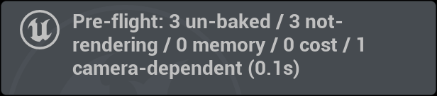](../media/guide/qs-preflight-toast.png)

*图：预检完成后编辑器右下角的提示（截图场景的结果）。*

**它会不会改动场景**：不会。预检只读取设置，除了写这两份报告文件以外，不修改关卡、资产或工程设置，也不会自动修复任何问题。

**怎么处理报告里的内容**：每一条都是“需要你看一眼的候选项”，不是确认的错误。逐条判断：

- 需要修的就修，例如：
    - 烘焙缓存；
    - 给光柱配一盏真实光源；
    - 把材质改成不透明或遮罩；
    - 让材质改读世界方向；
    - 给报告列出的动态材质实例的根材质勾选 Compute Fog Per Pixel。

- 确认不影响你这个镜头的，就接受它。

改完后再运行一次。**预检没有报出问题，不代表渲染结果一定正确**：它不检查曝光、光追设置，也不检查插件面板里的设置，最终仍以实际渲染出来的画面为准。基础版报告里有几句提到“其他渲染机器”，单机渲染时可以忽略。

### 6. 续渲（基础版与分布式渲染版都支持）

渲染中途停了（进程被关掉、断电、某一帧失败）时，插件可以接着渲，不用从头来。每次开始渲染时，插件都会把这次任务的全部设置存一份到输出文件夹的 `_metadata` 里，续渲时用它恢复。

1. **打开任意一个任务的设置**：重新打开工程后 MRQ 队列通常是空的，添加一个任务即可，关卡和序列选哪个都行（点 Resume Render 时会换回那次渲染的关卡、序列和设置）。队列里最好只留这一个任务：Resume Render 会像 Render (Local) 一样渲染整个队列，而且队列里有好几个任务时，插件可能分不清要替换哪一个。
2. **把输出文件夹指向那次渲染**：在 True ODS Panoramic 的 **Output** 区，把 **Panorama Output Folder** 设成那次渲染的输出文件夹（当时留空的，这里也留空）。文件夹里有一次没渲完的渲染时，下方会出现黄色提示：已完成多少帧、在第几帧停下、设置是否已随帧保存。

    [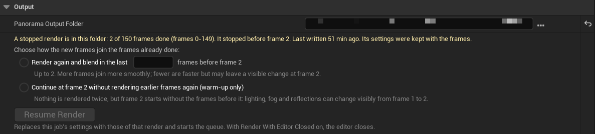](../media/guide/qs-resume-output.png)

    *图：输出文件夹里有一次在第 2 帧前停下的渲染时，Output 区出现的续渲提示和选项（UE 5.7 基础版）。按钮在选好衔接方式之前是灰的。*

3. **选择中断处怎么衔接**（每次都要自己选，没有默认项）：
    - **Render again and blend in the last X frames before frame N**：把第 N 帧之前的 X 帧重新渲染，并与已有的帧逐帧混合后写回，新渲染所占的比例逐帧升高（X 为 3 时依次是 25%、50%、75%），第 N 帧起完全是新渲染的。
        - X 越大，衔接越平滑；X 最多等于第 N 帧之前连续已完成的帧数。
        - 代价：多渲 X 帧。缺失的帧后面还有已完成的帧时，接回去的地方也会同样混合 X 帧，共约 2X 帧。提示里会给出多渲的帧数，以及按那次渲染的每帧耗时估算的时间。
        - 混合前的原帧保存在输出文件夹的 `_resume_originals` 里。

    - **Continue at frame N without rendering earlier frames again (warm-up only)**：不多渲任何帧，直接从第 N 帧开始渲。
        - 风险：第 N 帧没有前面帧的积累，光照、雾和反射在第 N−1 帧到第 N 帧之间可能出现肉眼可见的跳变。缺失的帧后面还有已完成的帧时，接回去的地方也可能跳。

    - 使用 Path Tracing 时没有这个选择，直接从第一个缺失帧继续。

4. **点 Resume Render**：
    - 任务的设置会被换成那次渲染保存的设置（关卡、序列、True ODS Panoramic 和 MRQ 自带的设置），设置窗口关闭，然后像点 **Render (Local)** 一样开始渲染队列；Render With Editor Closed 开着时，编辑器照常关闭。
    - 已完成、并且与设置一致的帧会跳过；缺的帧补渲。
    - 队列里其他已启用的任务也会一起渲染，和 Render (Local) 相同。
    - 按钮是灰的时候，旁边会写原因，例如还没选衔接方式、本机还有后台渲染在跑，或者这次渲染两分钟内还在写文件（可能还没停）。

**注意**：

- 续渲前不要改动序列和场景内容。插件会逐帧核对设置记录，记录不一致的帧会重新渲染。
- 不要删除已经写出的帧，也不要删除输出文件夹里的 `_metadata`（里面有进度记录、逐帧记录和这次任务的设置副本）。
- 旧版本插件渲染的输出没有设置副本：提示会写明“settings were not kept”，Resume Render 会使用设置窗口里当前的设置。这时设置必须与当时完全一致（例如从当时存的预设导入），否则不一致的帧会重新渲染。

**分布式渲染版多机任务**：中断后，在 **TrueODS Multi-Machine** 窗口第 4 步使用 **Resume Render Job**，入口与步骤见[版本与工作流](EDITIONS.md)。

### 7. 基础版 / 分布式渲染版与 UE 5.7 / 5.8 的实际差异

**基础版与分布式渲染版**

- **插件名和菜单**：基础版在插件列表里叫 **TrueODS Panoramic**，菜单栏显示 **TrueODS**；分布式渲染版叫 **TrueODS Panoramic Distributed**，菜单栏显示 **TrueODS Distributed**。
- **TrueODS Distributed 菜单多出 Multi-Machine Rendering 分组**：
    - **Multi-Machine Rendering**：打开一个独立的多机渲染窗口，标签页标题是 **TrueODS Multi-Machine**。它和下面插件面板里的 Multi-Machine Rendering 区不是一回事；
    - **Watch Console**：进度窗口；
    - **Latest Advisory Report**：最近一次渲染的报告；
    - **Latest Run Folder**：最近一次渲染的文件夹。

    多机流程见[版本与工作流](EDITIONS.md)。

- **插件面板**：分布式渲染版在 Rendering 区和 Render Passes 区之间多一个 **Multi-Machine Rendering** 区。
    - 总能看到 **This Job's Checksum**（当前设置的校验码）和 **Copy** 按钮，以及开关 **Rendering On Several Machines**（默认关）。
    - 打开这个开关后，才会出现：**Settings Checksum**（默认开）、**Require This Checksum**、**Consistent Motion Timing**（默认开）。
    - 单机渲染时保持关闭即可。

    [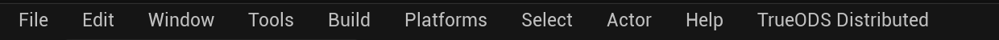](../media/guide/qs-menu-trueods-distributed.png)

    [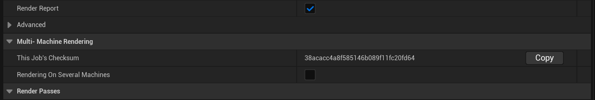](../media/guide/qs-distributed-multimachine-section.png)

    *图：UE 5.8 分布式渲染版的菜单栏，以及插件面板中的 Multi-Machine Rendering 区（默认设置）。校验码由插件与 MRQ 设置、引擎版本、启用的插件和工程文件算出，所以你看到的数值会与截图不同；这些都相同时，校验码也相同。*

- **时序锁定**：分布式渲染版的 **Consistent Motion Timing** 默认开启，而且在单机渲染时也生效，只是开关要打开 Rendering On Several Machines 后才显示。
    - 它让水、火、闪烁等随时间变化的效果，在分段和不同机器之间保持同一时间位置。
    - 不增加渲染时间。
    - 基础版没有这项功能。

- 其余参数、取景预览、预检、续渲，两个版本都一样。

**UE 5.7 与 UE 5.8**

- **同一份源码**：两个引擎版本使用同一份插件源码，插件面板和使用流程相同；Fab 为每个引擎版本提供单独的安装包。对照 UE 5.7 和 UE 5.8 的插件面板，除分布式渲染版独有的 Multi-Machine Rendering 区和下面的 DLAA 状态外，各区的参数和顺序一致。
- **DLAA**：插件按 DLSS 插件的版本号判断能不能用，目前只验证过 UE 5.7 上的 8.4 版。
    - UE 5.8 上没装 DLSS 插件时，DLAA 是灰的，DLAA Status 显示下图的安装说明；
    - 装了版本号不是 8.4 的 DLSS 插件时，DLAA Status 会提示该版本未经验证（“has not been verified … DLAA stays off”），DLAA 仍然是灰的；
    - 其他抗锯齿方式不受影响。

    [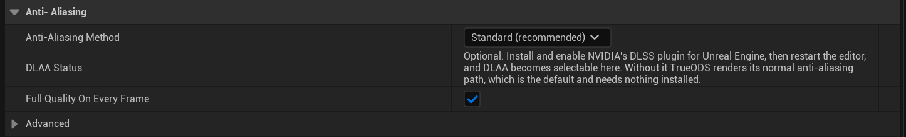](../media/guide/qs-antialiasing-ue58-no-dlss.png)

    *图：UE 5.8 上没装 NVIDIA DLSS 插件时，DLAA Status 显示的通用安装说明。默认使用 Standard 抗锯齿，不需要额外安装任何东西。*

- **Film > Method = Standard ACES**：这个选项只有 UE 5.8 才有，插件的 HDR 色调处理不读取它。
    - 如果工程在 5.8 里使用 Standard ACES，PNG / JPG / TIFF 的颜色可能与视口不一致；
    - EXR 线性母版不受影响。遇到这种情况，请以 EXR 为准，在调色软件里转换。

### 需要帮助

渲染失败时，请保留日志（`<工程目录>/Saved/Logs`）和输出文件夹里的 `_metadata`，按[支持模板](SUPPORT.md)联系 [trueodssupport@gmail.com](mailto:trueodssupport@gmail.com)。

## English

This page follows the order you actually work in. The main path is:

**1. Install → 2. Add the MRQ settings → 3. Understand and set the parameters → 4. Render**

- The framing preview, the scene check (section 5) and test renders are optional; do them before you start the render in section 4.
- Section 6 covers resuming a stopped render.
- Section 7 covers the differences between the base TrueODS edition and TrueODS Distributed and between UE 5.7 and 5.8.

**On this page**

1. [Install](#en-install)
2. [Add the MRQ settings](#en-mrq)
3. [Understand and set the parameters](#en-parameters)
4. [Render](#en-render)
5. [Optional tools: framing preview and scene check](#en-optional)
6. [Resume a stopped render (both editions)](#en-resume)
7. [Edition and engine differences](#en-differences)

**Parameter sections:** [Setup](#en-setup) · [Format](#en-format) · [Stereo](#en-stereo) · [Resolution](#en-resolution) · [Output](#en-output) · [Look](#en-look) · [Anti-Aliasing](#en-anti-aliasing) · [Rendering](#en-rendering) · [Render Passes / Simulation / Performance / Diagnostics](#en-other-settings)

**About the screenshots:** every image below was captured from the plugin's real interface. Click an image to view it full-size.

- Sections 1–6 show UE 5.7, base edition; section 7 shows UE 5.8, TrueODS Distributed; all on Windows.
- Screenshots are cropped and private local paths are obscured. Parameter values are unchanged.
- The values are the defaults of a newly added **True ODS Panoramic** setting, which are the recommended settings.

Exceptions (the captions repeat them):

- **Manual EV100** and **Exposure Reference** show the exposure read from the captured scene. It differs from scene to scene.
- **DLAA Status** shows Ready because the capture machine has the NVIDIA DLSS plugin installed. Without it, the row shows a different text (see section 7).
- The yellow triangle at the end of the True ODS Panoramic row in the settings list is an MRQ notice caused by the capture project's own ray-tracing settings (see the caption in section 2).

Scope: Unreal Engine 5.7 and 5.8, the Windows 64-bit editor, DX12 / SM6, and Movie Render Queue (MRQ). The base edition and TrueODS Distributed share this workflow. Section 7 lists what TrueODS Distributed adds.

### 1. Install

1. Save the project and close Unreal Editor, then install the TRUEODS package that matches your UE version. Fab provides a separate package for 5.7 and for 5.8.
    - For a manual install, put the whole `TrueODS` folder in the project's `Plugins` folder.
    - Keep one installation only: not one copy in the project and another in the engine.

2. Open the project, search for **TrueODS** under **Edit > Plugins**, enable it and restart when asked.
    - The base edition is listed as **TrueODS Panoramic**; TrueODS Distributed is listed as **TrueODS Panoramic Distributed**.
    - The plugins it needs (Movie Render Pipeline, Niagara, Level Sequence Editor) are enabled with it.

3. After the restart, a **TrueODS** menu (base edition) or **TrueODS Distributed** menu appears to the right of **Help** in the menu bar. That means the plugin loaded.

    

    *UE 5.7 menu bar, base edition. TrueODS Distributed shows a TrueODS Distributed menu here.*

### 2. Add the MRQ settings

1. Open **Window > Cinematics > Movie Render Queue**, click **+ Render** and pick the Level Sequence. A job appears in the queue.

    

    *The MRQ queue. Click Unsaved Config in the Settings column to open the job settings. Render (Local), bottom right, starts the render (section 4). The job in the capture already has True ODS Panoramic added and was renamed, so the Output column shows the folder the plugin wrote (a local path, obscured in the capture). A brand-new job shows MRQ's default output directory here.*

2. Click the link in the job's **Settings** column (**Unsaved Config** for a new job) to open the job settings window. **This window edits a temporary copy of the job:**
    - when you have finished the settings in section 3, click **Accept** at its bottom right to apply them to the job (section 4);
    - **Cancel**, or closing the window, discards every change;
    - while this window is open, MRQ's Render (Local) is greyed out.

3. Click **+ Setting** at the top left of the window and choose **True ODS Panoramic** in the **Rendering** group. It is the same plugin as TrueODS Panoramic in the plugin list. Here the name has spaces and is followed by a short summary in brackets.
4. **Keep only True ODS Panoramic and Output in the job settings.**
    - A new MRQ job comes with **Deferred Rendering** and **JPG Sequence**. Select each and press Delete.
        - True ODS Panoramic does all of the panorama rendering and output.
        - The plugin neither checks nor removes other render or output entries. If they stay, MRQ may also render and write ordinary images, which wastes render time and VRAM.

    - If you added MRQ's own **Anti-aliasing** entry (a separate item in the settings list, not the Anti-Aliasing section of the plugin panel), you can delete it too.
        - When the plugin needs one, it adds it by itself at the start of the render, for simulation warm-up (see **Simulation Warmup Frames**).
        - Panorama anti-aliasing is set in the plugin panel's Anti-Aliasing section. Deleting MRQ's entry does not turn it off.

5. **Keep MRQ's own Output setting, but leave it as it is.** It is a separate entry in the settings list; do not delete it. The plugin fills in its key fields:
    - **Output Directory** is set to the plugin panel's output folder, or to `<project folder>/TrueODS/Renders` when that field is empty.
    - **Use Custom Playback Range / Custom Start Frame / Custom End Frame** are set to the frames to render. The start frame is earlier than your first frame (-64 in the picture below). Those extra frames are reserved for the plugin's warm-up (see "three different warm-ups" at the start of section 3) and are never written as images.
    - **Output Resolution** is changed to 256×256 by the plugin when a render starts. This is not the panorama size; the plugin panel sets that, so leave it.
    - **File Name Format** is not used for the panorama files. Panorama file names are set in the Output section of the plugin panel.

    If you change the directory or the range here, the plugin sets them back at once. Leave the other fields at their MRQ defaults as well:

    - **Use Custom Frame Rate / Output Frame Rate**, **Output Frame Step** and **Handle Frame Count** are MRQ's own frame controls. The plugin does not read them, but changing them can make the frames MRQ renders differ from the plugin panel's range.
    - **Frame Number Offset**, under Output's **Advanced**, is added to the panorama frame numbers. Keep it at 0.

    

    *Left: the settings list holds only True ODS Panoramic and Output. Right: what MRQ's own Output setting shows when it is selected.*

    - *The plugin wrote Output Directory, Custom Start Frame (-64) and Custom End Frame; the ↺ marks show they are no longer MRQ's defaults. Output Resolution is only rewritten when a render starts, so it still shows 1920×1080 here.*
    - *The yellow triangle after True ODS Panoramic in the list is an MRQ validation notice.*
        - *It appears only when a project has ray tracing on but ray-traced shadows off, as the captured project does, and it says that ray-traced shadows are off.*
        - *In that situation it also reminds you to press Use Scene Exposure if the exposure has not been read yet.*
        - *It may not appear in your project, and it does not block the render.*

6. **Don't mix up the two things called "Output":**
    - **MRQ's own Output setting** is the separate entry above. Keep it, but leave it alone.
    - **The Output section of the plugin panel** is one group of True ODS Panoramic's parameters. Set the output folder, frame range, file names and image format there (section 3).

### 3. Understand and set the parameters

Select **True ODS Panoramic** in the settings list. All of the plugin's parameters appear on the right; this guide calls that area the "plugin panel". **The defaults are the recommended settings.** On a first job you usually only need to check two things:

- the output folder and frame range in the **Output** section;
- the exposure in the **Look** section.

**Checking the exposure:** when the plugin panel first opens, the plugin reads the exposure of the current viewport once. The value it read is shown in **Exposure Reference** in the Look section.

- If the viewport brightness is what you want, leave it.
- To judge by another direction, turn the viewport there and press **Use Scene Exposure** in Look.
- If it reads "No viewport exposure yet…", nothing was read yet; see the Look section below.

**The panel has three different "warm-ups":**

1. **Simulation warm-up** (Simulation Warmup Frames) lets particles and weather run before output, without writing images.
2. **Frame warm-up** (Warm Up Before First Frame / Warm Up Frames) renders frames and throws them away, so fog, volumetric light and indirect light are already settled in the first written frame.
3. **Warm-up views** (Warm-up Pages / Warm View Resolution Cap) only affect VRAM use, not the picture.

The 64 extra frames in MRQ's Output are reserved for the second and third kinds.

The parameters below follow the plugin panel from top to bottom. Each entry says what it controls, its default, when to change it, and whether changing it affects image quality, render speed or video memory (VRAM).

- A greyed-out row has no effect with the current settings.
- A row that only appears under certain conditions says so.
- Hidden and experimental properties that are not in the panel are left out.

*The whole plugin panel at its defaults, from Setup to Diagnostics.*

- *The Advanced groups of Rendering and Performance are expanded in this capture; the Anti-Aliasing Advanced group and Diagnostics are collapsed.*
- *Manual EV100 and Exposure Reference show the exposure read from the captured scene.*
- *The yellow triangle is explained in the caption in section 2.*
- *The images below show each section.*

#### Setup

*Setup, Format, Stereo and Resolution, at their defaults.*

- **Restore Recommended Settings** (button): puts the plugin's settings back to the recommended values.
    - **Not** restored: the output folder, file name format, frame-number digits, Render Whole Sequence and the frame range, the Look LUT, and the exposure already read from the scene. TrueODS Distributed also keeps Require This Checksum.
    - Press it when settings got mixed up or you reuse an old preset. Undo (Ctrl+Z) reverts it.

#### Format

- **Format** (default **360 (full sphere, 2:1)**): a full 360° sphere, or the front hemisphere only, **180 (front hemisphere)**.
    - With 180 and a resolution preset, each eye is square; the 8192 preset gives 4096×4096 per eye. When you choose 180, also set Stereo Layout (Stereo section) to Side by Side.
    - With 180 the plugin renders only the half of the view that the front hemisphere needs, so a frame takes about half as long as 360, and the output image is smaller.

- **Projection** (default **Equirectangular**):
    - **Equirectangular**: the one-image-per-eye layout VR headsets and 360 players expect.
    - **Cubemap Faces**: writes the faces of a cube as separate images instead, 6 for 360 and 5 for 180, mono or stereo.
        - Cube faces are named and written by their own rules, not by the Output section's file-name and image-format settings. Try a short range first to check they fit your pipeline.
        - With Cubemap Faces, HDR Tone Chain below is hidden.

- **Match Viewport Color** (default on): the panorama uses the scene's own tone mapping and post-process colour, matching the viewport. Off switches to the old fixed filmic curve. It affects colour; you rarely need to turn it off.
- **HDR Tone Chain (recommended)** (default on; shown only when Format is 360 or 180, Projection is Equirectangular and Renderer is Deferred):
    - On: the whole panorama is assembled in HDR and tone-mapped once. The EXR is a true linear master; grade it as a Linear input. The PNG / JPG / TIFF carry the finished look.
    - Off: the old 8-bit processing, and the EXR is no longer scene-linear.
    - Keep it on. With it on, VRAM use may be slightly higher.

#### Stereo

- **Stereo** (default on): two-eye stereo. Off renders a mono panorama; half as many eyes are rendered, so it takes roughly half the time.
- **Stereo Layout** (default **Top / Bottom**; shown only with Stereo on): only changes how the two eyes are packed. Quality and speed are unaffected.
    - **For 360, Top / Bottom is recommended:** at 8192 the image is 8192×8192 (8192×4096 per eye).
    - **For 180, Side by Side is recommended:** at 8192 the image is 8192×4096 (4096×4096 per eye). The default is Top / Bottom, so switch to Side by Side yourself when you choose 180.

    If your player or post pipeline needs something else, follow it.

- **IPD (cm)** (default 6.5; shown only with Stereo on): the distance between the eyes, which sets how strong the depth is. Larger values give more depth and make close objects less comfortable to view. No effect on speed.
- **Pole Merge Angle** (default 60; shown only with Stereo on): the latitude from which the two eyes blend towards mono, fully merged straight up and straight down. Full stereo is uncomfortable in a headset when you look up or down. 90 turns the blend off. Affects viewing comfort only.
- **Far Eye Merge (px, experimental)** (default 0 = off; shown only with Stereo on): experimental; leave it at 0.
    - The number is a distance threshold measured in output pixels. Distant content whose left/right offset is at most this many pixels uses the same image for both eyes, so the far background matches more closely between the eyes.
    - Rough guide at 8192 per eye and an IPD of 6.5 cm (horizontal direction): 1 ≈ beyond 85 m, 2 ≈ beyond 42 m, 4 ≈ beyond 21 m, 8 ≈ beyond 11 m.
    - The cost: in the merged distant areas, water, glass and reflections get the wrong stereo depth, and each frame takes more render time and VRAM.
    - It only affects Equirectangular output.

#### Resolution

- **Resolution Preset** (default **8192 / eye (Recommended, ~22.8 px/deg)**): width per eye. Choose 4096, 6144, 8192, 12288 or 16384, or type your own. Higher is sharper; render time grows roughly with the pixel count, and VRAM use goes up.
- **Output Width Per Eye** (default 8192): the actual width per eye.
    - A preset fills it in. Typing a value switches the preset to **Custom (manual)**, which is expected.
    - For 360 the height is half the width; for 180 it equals the width.

- **Supersample** (default 150%): renders at a higher internal resolution and scales down. Higher gives cleaner edges but is slower and uses more VRAM.
- **VRAM Mode** (default **Paced (recommended)**): how hard the plugin works to keep the render inside your video memory. **The picture is identical at every setting.** Textures are always fully loaded; only temporary render memory and speed change.
    - When to change it: a render fails for lack of video memory, or heavier frames suddenly take several times longer (the GPU has started borrowing system memory). Move down one step and render again.
    - **Tiled 2x2 / 3x3 / 4x4** cut peak temporary VRAM to about 1/4, 1/9 or 1/16. Rendering gets much slower; the setting's tooltip estimates about 4, 9 or 16 times as long.
    - How to choose (the tooltip's guide):
        - Paced for 24 GB+ cards at 8K, or 12–16 GB cards at 4K;
        - Tiled 2x2 for 12–16 GB cards at 8K;
        - 3x3 to 4x4 for 8–12 GB cards.

    - **Normal** does no memory management; use it only when your GPU has plenty of VRAM to spare.

- **Warm-up Pages** (default 0 = automatic: 4 with Normal, Paced or Tiled 2x2; 9 with Tiled 3x3; 16 with Tiled 4x4): lowers the VRAM peak at the start of the render, at almost no time cost.
    - Higher values lower that peak further, and the start frame in MRQ's Output moves earlier; this is expected.
    - If Paced still runs out of memory but Tiled is too slow, try a higher value here, for example 8 (maximum 16). Paced already uses 4 automatically, so entering 4 changes nothing.

- **Apply Recommended Render Settings** (default on): for the length of the render, the engine settings a panorama needs are applied, then put back afterwards, so the project itself is not changed. They are:
    - motion blur off;
    - dark edges where objects meet removed (this is not lens vignetting);
    - shadow sharpness and ray-traced shadow samples tuned;
    - texture loading boosted.

    Turn it off only when one of them fights your scene. Six manual rows then appear:

    - **Disable Motion Blur**
    - **Remove Dark Halos**: removes the dark edges and halos where objects meet each other, walls or the floor; it is not lens vignetting. Indirect light loses a little detail.
    - **Sun Shadow Sharpness**
    - **Lamp Shadow Sharpness**
    - **RT Shadow Samples Per Pixel**
    - **Boost Texture Streaming**

    Note that with it off, the plugin still writes the shadow sharpness and ray-traced shadow sample values from these rows; it does not fall back to the project's own settings. A shadow sharpness of 0 is written as 0 (the tooltip's "0 leaves the project's setting alone" is not what happens). Sharper shadows and more samples cost time and VRAM.

- **Warm View Resolution Cap** (default 256): lowers peak VRAM at high output resolutions. 0 = no cap, highest VRAM use. The picture does not change either way; keep the default.

#### Output (the Output section of the plugin panel)

*Output and Look, at their defaults. Manual EV100 and Exposure Reference show the exposure read from the captured scene; they are not defaults.*

- **Panorama Output Folder** (default empty): where finished frames are written.
    - Empty writes to `<project folder>/TrueODS/Renders`. The tooltip says Saved/TrueODS, but the files go to the folder above.
    - Use a new, empty folder for each job; resuming works from this folder's records (section 6).
    - When this folder holds a render that did not finish, a resume notice and a **Resume Render** button appear under it; see section 6.

- **Render Whole Sequence** (default on): renders the whole Level Sequence. To render part of it, turn this off and fill in the two rows below. The plugin arranges the warm-up frames the render needs before the first frame; MRQ's own Output needs no change.
- **First Frame / Last Frame** (default 0 / 0): the first and last frames written, in sequence frame numbers, both included. Greyed out while Render Whole Sequence is on.
- **File Name Format** (default `TrueODS.{frame_number}.equirect`): the name of each frame, without extension. MRQ placeholders such as `{sequence_name}`, `{map_name}` and `{date}` work. If the name has no frame number, one is added at the end.
- **Frame Number Digits** (default 1 = no zero padding: 0, 1, 2 …): the minimum number of digits of the frame number in each file name; shorter numbers get leading zeros. Some editing tools only recognise an image sequence when every frame number has the same number of digits; in that case set 4 or more, enough for your longest sequence.
- **Image Format** (default **PNG (8-bit)**): the viewable image written per frame. The panorama does not use MRQ's own output formats; choose the format here only.
    - **PNG**: lossless, 8-bit.
    - **JPG**: small files, quality 95.
    - **TIFF**: 16-bit, uncompressed, large files.
    - **None (EXR master only)**: no viewable image, EXR only.

- **Also Write EXR (HDR master)** (default on): also writes a linear, ungraded HDR master `.exr`. Grade from this file; the PNG / JPG / TIFF beside it is only a version with the preset look applied.
- **EXR Compression** (default **DWAB**; shown only when EXR is written): DWAB gives small files with no visible loss at normal grading exposures, but it is lossy. Choose ZIP or PIZ for lossless files, several times larger. None is larger still.
- **Render With Editor Closed** (default on): when the render starts, the editor closes, a background process renders, and a progress window opens.
    - It saves memory. On a large scene at high resolution, the editor's own share is what most often runs a machine out of memory.
    - The picture is identical to an in-editor render.
    - The editor closes, so check every setting before you start. Turn this off to render inside the editor.

- **Save Modified Content First** (default on; shown only when Render With Editor Closed is on): whether modified levels and assets are saved before the editor closes.
    - On: they are **saved without asking**. Off: the editor closes without saving and those edits are lost.
    - **If saving fails, the render does not start.** The editor stays open and the Output Log shows `[TrueODS][EDITOR_CLOSED] saving modified content FAILED`. Save by hand and fix whatever blocked the save, or turn this off if the changes can be discarded, then start again.

#### Look

- **Bake Film Look Into EXR Master** (default off): off keeps the full highlight range in the EXR master for grading. On bakes the film curve into it; bright areas flatten and cannot be recovered in grading. Turn it on only for a scene that looks wrong without it.
- **Exposure** (default **Manual EV100**): where the panorama's brightness comes from.
    - **Auto**: uses the shot camera's own exposure, but also meters the scene and switches to the metered value when the two differ by more than Auto Exposure Tolerance. The log says which one it used.
    - **Match Viewport**: locks to the exposure you see in the editor viewport now.
    - **Camera / Scene**: always the camera's or post-process volume's own exposure.
    - **Neutral Auto Meter**: always meters again and ignores the scene's exposure settings.
    - **Manual EV100**: uses the fixed value below.

    The drop-down marks Auto as "recommended", but in this version the default is Manual EV100, filled in from the scene (next two rows).

- **Exposure Reference** (read-only): the viewport exposure read since the panel was opened, for example "EV100 -1.01 = viewport now (+1 = one stop darker)". After you reopen the panel this row can be empty. That does not mean the exposure was lost; the value in Manual EV100 still applies.
- **Scene Exposure → Use Scene Exposure** (button): reads the exposure of the current perspective viewport into Manual EV100, with no render needed.
    - Before pressing it, turn the viewport to the direction the exposure should be judged by.
    - Afterwards, check Exposure Reference. "No viewport exposure yet…" means nothing was read yet: click in the viewport so it renders a frame, then press again.
    - The first time the panel opens, if Exposure is Manual EV100 and nothing has been read yet, the plugin reads the viewport once by itself. That is why Manual EV100 in the capture shows the captured scene's value.

- **Auto Exposure Tolerance (stops)** (default 1.0): only used when Exposure is Auto; greyed out otherwise. It sets how many stops the camera's exposure may differ from the metered value before Auto stops trusting the camera. Raise it if Auto overrides a deliberately dark or bright look.
- **Manual EV100** (shown only when Exposure is Manual EV100): the fixed exposure. Lower is brighter; +1 is one stop darker.
    - It is the plugin's own scale and does not add the scene's Exposure Compensation, so do not copy the number from a camera's post-process settings.
    - Normally read it with the button above rather than typing it.

- **Exact Exposure** (default on): makes the finished frames land exactly on the exposure set above. It costs a moment once at the start of the job and nothing per frame. Keep it on.
- **Output Look LUT (.lut1d.txt)** (default empty = the LUT bundled with the plugin): applies to PNG / JPG / TIFF only and **never** to the EXR. Set a path to use your own look.
- **Global Tone Creative Exposure (EV)** (default 0; shown while HDR Tone Chain is ticked): adjusts the overall brightness of the PNG / JPG / TIFF only, in stops. **+1 is one stop brighter**, the opposite direction to Manual EV100.
    - The EXR master's pixels are not changed; the value is only recorded in the EXR header.
    - With Cubemap Faces or Path Tracing, the HDR Tone Chain row is hidden but this row stays visible. It then has no effect.

#### Anti-Aliasing

*Anti-Aliasing and Rendering, at their defaults.*

- *DLAA Status shows Ready because the capture machine has the NVIDIA DLSS plugin installed.*
- *The Anti-Aliasing Advanced group is collapsed and holds only Near Clip Distance (cm). The Advanced group of Rendering is expanded in this capture.*

- **Anti-Aliasing Method** (default **Standard (recommended)**; shown only with the Deferred renderer):
    - **Standard**: steady highlights and indirect light, matching the viewport.
    - **Alternative**: a little noisier, occasionally kinder to fast movement.
    - **DLAA**: needs a verified NVIDIA DLSS plugin. Without one it is greyed out, and hovering shows why.
    - **Off**: fastest, but highlights and indirect light shimmer from frame to frame.

    A job set to DLAA without DLSS available renders with Standard and leaves only a warning in the log.

- **DLAA Status** (read-only): whether DLAA can be used, and why not.
- **Full Quality On Every Frame** (default on; Deferred only): gives every frame the full quality of the first. It costs extra time when Samples Per Pane is 2 or more. Off makes later frames faster but can show a square glow near volumetric-fog lights.
- **Advanced > Near Clip Distance (cm)** (default 0): how close to the camera something can be and still be drawn. 0 keeps almost everything (it is treated as 1 cm) and is right for almost every shot. Raise it only to leave out something touching the lens, such as a shoulder or a prop.

#### Rendering

- **Analyze Scene & Sequence (Pre-flight)** (button): the scene check in section 5. Run from this button, it does **not** check the sequence. To check the sequence too, use the menu entry of the same name.
- **Renderer** (default **Deferred (recommended)**):
    - **Deferred** is fast and right for almost every job.
    - **Path Tracing** gives reference-quality light and reflections, but takes hours per frame instead of minutes. Path Tracing must already be enabled in the project, or the job stops.

    Both renderers produce correct stereo. With Path Tracing, these rows are hidden:

    - Samples Per Pane and Thin Detail Stability;
    - Warm Up Before First Frame, with its Warm Up Frames / Warm Up Sparse Stride / Warm Up Full Frames rows;
    - Anti-Aliasing Method, Full Quality On Every Frame and HDR Tone Chain.

    Warm Up From Sequence Start, Sequence Efficiency and DLAA Status stay. Two new rows appear:

    - **Path Tracing Samples Per Pane** (default 64): more samples, less grain; time grows roughly in proportion.
    - **Path Tracing Denoiser** (default Project): whether to denoise.

- **Samples Per Pane** (default 2; Deferred only): the sample count.
    - 2 keeps hair, wires, railings and foliage clean, and Thin Detail Stability needs it.
    - 1 is faster and looks the same on scenes without thin detail.
    - Render time rises with the count, but by less than the count.

- **Warm Up Before First Frame** (default on; Deferred only): renders and throws away up to Warm Up Frames frames first, so the first written frame looks like the frames after it. The difference shows most in fog, volumetric lighting and indirect light. Resume blending also depends on it (section 6).
    - The warm-up uses the sequence frames before the start of the range; it can only use as many as exist.
    - With the default Render Whole Sequence, the range starts at the sequence's first frame, so nothing comes before it. No warm-up time is spent, but the first written frame can differ slightly from the rest.
    - If that frame matters, extend the sequence's playback range earlier in Sequencer (by up to Warm Up Frames frames) so there are enough frames before the range.

- **Sequence Efficiency** (default on): faster when rendering a run of frames; the picture is unchanged. Makes no difference for a single frame.
- **Warm Up Frames** (default 0 = 32 frames; shown only when Warm Up Before First Frame is on and the renderer is Deferred): the maximum number of frames rendered and thrown away before the first written one. Each costs one frame of render time.
- **Warm Up Sparse Stride** (default 0 = off; shown under the same condition as Warm Up Frames): makes the frame warm-up cheaper; higher values save more time, and it needs 2 or more to take effect. Written frames are not affected.
- **Warm Up Full Frames** (default 4; shown under that condition when Warm Up Sparse Stride is above 0): while Warm Up Sparse Stride is in effect, how many of the last warm-up frames are still rendered at full quality.
- **Warm Up From Sequence Start** (default on): plays the sequence from its first frame up to the render range, so effects that build up over time (smoke filling a room, growing foam) look as they would in one continuous render. It costs about half a second per sequence frame before the range, and nothing when the range starts at the sequence's first frame.
- **Texture Sync Per Pane** (default on): stops an occasional soft, low-resolution patch of texture from being baked into a frame. The problem comes and goes, so one clean test render does not show that turning this off is safe. It costs very little; keep it on.
- **Render Report** (default on): writes `trueods_advisory.md` (plus a `.jsonl`) into `_metadata` in the output folder. It only records; it changes nothing in the scene and costs no render time. It lists:
    - the number of cloth and hair components in the scene;
    - simulations whose result can differ from render to render (under the heading "Cross-machine consistency", which also appears for single-machine renders);
    - per frame, how many texture loads had to be waited for, and in which directions textures arrived late, where that area may look soft.

    Low-VRAM warnings are not in this report; they appear only in the log and the progress notification.

- **Advanced > Thin Detail Stability** (default on; shown only with Deferred and Samples Per Pane above 1): removes shimmer and crawling from thin geometry.
    - The trade: objects very close to the camera can get a faint double image and slightly softer surface detail.
    - Which is better depends on the shot; if unsure, render one frame each way and compare.
    - No extra render time.

#### Render Passes, Simulation, Performance, Diagnostics

*Render Passes, Simulation, Performance and Diagnostics, at their defaults. Performance's Advanced group is expanded in this capture; Diagnostics is collapsed.*

- **Render Passes**: shows only the text "In development"; this feature is not available yet and has nothing to set.
- **Simulation Warmup Frames** (default 90): frames simulated before the first written frame.
    - Particles, weather and falling debris start empty in an offline render and need simulation time to look as they do on screen.
    - It runs once per job, so a continuous frame range stays continuous.
    - For static scenes, 0 is fastest.

- **Performance > Advanced:**
    - **Panes Per Batch** (default 4): 4 is fastest; lower it only if your GPU driver becomes unstable. The picture is the same at any value.
    - **Assemble In Background** (default on): assembles the finished panorama while the next frame renders, saving time with an identical result.
    - **Texture Memory Scale** (default 0 = automatic): raise it by hand only if surfaces stay soft or visibly swap detail during a render; it costs VRAM.

- **Diagnostics > Advanced:** **Dump GPU Memory Per Frame** and **Log Texture Memory Each Frame** are off by default. They are for troubleshooting only and make logs very large; keep them off.

### 4. Render

0. **(Optional) Before you click Render:**
    - If you want the framing preview or the scene check, do it now; see section 5.
    - For a complex scene, you can turn off **Render Whole Sequence** and render a few frames first to check exposure, seams, thin detail and stereo depth. If VRAM is a concern, also watch peak VRAM and time per frame.
        - With the defaults, a test render also closes the editor, and the MRQ queue is empty when you reopen the project.
        - So save a preset first (next step), or turn off Render With Editor Closed for the test.

    - None of this is required.

1. **Save a preset first (recommended):** open the preset button at the top of the job settings window (it reads **Unsaved Config** for a new job) and choose **Save As Preset** to save it in the project. The queue is empty when you reopen the project, and the preset brings the settings back. (Resuming does not need it: the plugin keeps the settings with the frames; see section 6.)
2. Click **Accept** at the bottom right of the job settings window. The window closes and the settings are applied to the job.
3. Click **Render (Local)** at the bottom right of the MRQ window. With the defaults, this happens in order:
    1. every modified level and asset is **saved without asking** (Save Modified Content First);
    2. the editor closes and a background process renders;
    3. a progress window opens.

    The editor does not reopen by itself when the render ends; reopen the project when you need it.

4. When the render finishes, the output folder holds:
    - one PNG and one EXR per frame, named `TrueODS.0.equirect.png` / `TrueODS.0.equirect.exr` and so on by default. At the 360 top/bottom 8192 setting, each image is 8192×8192 (8192×4096 per eye);
    - a `_metadata` folder with the progress record, the per-frame records and a copy of the job's settings (used for resuming), and `trueods_advisory.md` from Render Report;
    - `TrueODS_render_report.txt`: a short summary (frames, times, the exposure used) written when a background render reaches its last frame. The plugin also tries to show it in a window.

    View the images in a stereo-360 player or VR headset set to the matching layout (for example top/bottom).

### 5. Optional tools before rendering: framing preview and scene check

#### Equirect Preview (framing preview)

**What it does:** shows a live panorama of everything around the camera inside the editor, including behind, above and below it, so you can check the framing before rendering.

**How to open it:** menu bar **TrueODS** (base edition) or **TrueODS Distributed** **> Preview > Equirect Preview**. It opens a separate window called **TrueODS Preview**. You can also type `TrueODS.OpenPreview` in the console. Both editions and both engine versions have it.

*The Equirect Preview window at its defaults, following the level viewport and showing the full 360°.*

**What it is not:**

- It is a mono, low-resolution framing preview, not a sample of the final render.
- It does not read any True ODS Panoramic setting (format, stereo, resolution, exposure, Look LUT), so detail and brightness differ from the final render.
- It adds nothing to your scene and does not modify the level.

**Options in the window** (left to right):

- **Source** (default **Auto (Viewport Camera)**): follows the level viewport. When the viewport is locked to Sequencer's camera cuts, the preview follows the shot camera and changes as you scrub. The drop-down lists every camera in the level; pick one to pin the preview to it (shown as "Pinned: <camera name>").
- **Area** (default **All Directions (360° / 2:1)**): shows the full 360°. **Front Half Only (180° / Square 1:1)** shows only the hemisphere the camera faces, to check what a 180 frame contains. It affects the preview only, not the render output.
- **Keep Horizon Level** (default on): keeps the picture level and follows only the camera's left/right turn, as the final render does. Off follows the camera's tilt and roll, which the final render does not.
- **Display mode** (default **Workbench**):
    - **Workbench**: surface colours only, no lighting, animation updates live, fastest. Fog, clouds and translucent surfaces such as glass and water are not shown.
    - **Viewport Unlit**: the unlit look, animation updates live. Fog and clouds are not shown.
    - **Fast (No Dynamic Shadows)**: lit, but without shadows, reflections, volumetric fog, clouds and similar effects.
    - **Quality**: full lighting, closest to the final picture, and the slowest.

    Fast and Quality keep the last picture while playback or the camera moves, and refresh once it stops.

- **Pause Viewport** (default on): pauses the level viewports' continuous redraw while the preview is open, to spare the GPU. The viewport still redraws while you work in it, and everything returns to normal when the preview closes.
- **Resolution** (default **256 / face**; 256, 512 or 1024): higher is sharper and uses more of the GPU.
- **Extra EV** (default 0): brightens or darkens the preview on top of the scene's own exposure; it affects the preview only. Not available in Workbench and Viewport Unlit.

**Notes:**

- While it is open, the preview keeps using some GPU resources; close the window when you do not need it.
- With the default Render With Editor Closed, the editor and the preview close when the render starts. If you turned that off to render inside the editor, close the preview first.
- In Quality mode, fog and lighting are only approximate, and blocky light/dark edges can appear. This is a limitation of the preview; the rendered frames are what count.
- These options return to their defaults when the editor restarts.

#### Analyze Scene & Sequence (Pre-flight) (scene check)

**What it does:** a **static settings scan** of the open level and of the queue job's Level Sequence, looking for known conditions that affect panorama renders.

- It renders nothing and compares no pixels.
- It usually takes a few seconds. A large level with many lights and sequence bindings can take a minute or more, and the editor does not respond meanwhile.
- Only loaded sub-levels are checked; unloaded parts are not.

**Where to run it:**

- **Recommended:** the menu bar, **TrueODS** (base edition) or **TrueODS Distributed** **> Analysis > Analyze Scene & Sequence (Pre-flight)**.
    - It uses the first enabled TrueODS job in the queue and checks that job's sequence too. So click Accept in the job settings window first, so that the job really contains True ODS Panoramic.
    - With no such job, it checks only the open level.

- The plugin panel's Rendering section has a button with the same name. MRQ's settings window edits a temporary copy of the job, so from there the sequence is **not** checked, and the report begins with `Sequence: none`.

Before running it:

- open the job's level;
- open the sequence in Sequencer with the playhead inside the render range, so the effects and objects the sequence spawns exist in the scene and get checked.

**What it checks:** the report lists findings in five groups; groups with nothing to report are left out.

1. **Un-baked simulation**: cloth, hair, Niagara effects, physics, destruction, legacy Cascade particles and similar. These can come out differently on every render, so a resumed or repeated render may not match the same frame. The report suggests baking a cache or fixing the random seed.
2. **Things that will not render under default settings, or are handled for you:**
    - **Volumetric fog reminder:** shown whenever the level has volumetric fog and at least one light. It does not check whether emissive materials exist. It means: emissive materials do not produce light shafts in volumetric fog, so if you need a shaft, add a real light with Volumetric Scattering Intensity above 0. The heading says how many lights in the level can produce shafts.
    - **Per-vertex fog on large translucent surfaces:** with the default settings, these are switched to per-pixel fog during the render, and your assets are not changed. Materials driven by a Dynamic Material Instance cannot be corrected, though. The report lists them separately so you can tick Compute Fog Per Pixel on their root material.
    - **Fog volumes:** a fog volume within 1–2 m of the camera is only approximate; when the camera passes through a hard-edged fog volume, its boundary shows. Soften the volume's edges, or keep the camera outside it.
    - **Translucent materials on Nanite meshes:** these draw nothing.

3. **VRAM / RAM risk**:
    - When the check runs, more than half of the first NVIDIA GPU's memory is already in use. This counts the whole system, including the editor's own share, and is read with nvidia-smi (NVIDIA only).
    - Less than 16 GB of RAM is free.

4. **High-cost frames**: frame ranges of the sequence with heavy effects, which can be several times slower and use more VRAM.
5. **Materials that read the camera**: materials that use the screen position or the camera direction give different results in different directions of the panorama.

**Where the report is:**

- **Notification:** when run from the menu on a queue job, or from the panel button, an editor notification shows for about 8 seconds, for example "Pre-flight: 3 un-baked / 3 not-rendering / 0 memory / 0 cost / 1 camera-dependent (0.1s)". The numbers are the groups of findings in the five categories above, followed by the scan time. With no TrueODS job in the queue, the menu entry shows no notification and just opens the report.
- **Full report:** in `<project folder>/TrueODS/Reports/SceneAnalysis/scene_analysis_<date>_<time>.md`, plus a `.json` with the same name for tools. The `.md` opens in your default app.
- **Log:** a `[TrueODS][PREFLIGHT]` line in the Output Log.

*The notification after pre-flight (result for the captured scene).*

**Does it change the scene?** No. It only reads settings. Apart from writing the two report files, it changes no level, asset or project setting, and it fixes nothing automatically.

**What to do with the findings:** each item is a candidate to look at, not a confirmed defect. For each one, decide:

- fix it, for example:
    - bake a cache;
    - pair a light shaft with a real light;
    - make the material opaque or masked;
    - have the material read world directions;
    - tick Compute Fog Per Pixel on the root materials the report lists as dynamic instances;

- or accept it if it does not matter for your shot.

Run the check again after changes. **A clean report does not guarantee a correct render.** It does not check exposure, ray-tracing settings or the plugin panel's settings; the rendered frames are what count. A few sentences in the base edition's report mention "other render machines"; ignore them when rendering on one machine.

### 6. Resuming a stopped render (both editions)

If a render stops part-way (the process was closed, the power went, a frame failed), the plugin can carry on instead of starting over. Every time a render starts, the plugin keeps a copy of the job's settings in the output folder's `_metadata`, and resuming puts them back.

1. **Open the settings of any job.** After you reopen the project the MRQ queue is usually empty; add a job. Any level and sequence will do: Resume Render switches the job back to the level, sequence and settings of that render. Keep only this job in the queue: Resume Render renders the whole queue, as Render (Local) does, and with several jobs in the queue it may not be able to tell which one to replace.
2. **Point the output folder at that render.** In the **Output** section of True ODS Panoramic, set **Panorama Output Folder** to that render's output folder (leave it empty if it was empty). When the folder holds a render that did not finish, a yellow notice appears under it: how many frames are done, the frame it stopped before, and whether its settings were kept with the frames.

    

    *The resume notice and choices in the Output section when the output folder holds a render that stopped before frame 2 (UE 5.7, base edition). The button stays grey until a way to join is chosen.*

3. **Choose how the stop point is joined** (you choose every time; there is no default):
    - **Render again and blend in the last X frames before frame N:** renders the X frames before frame N again and writes each as a blend with the frame already there, the new render's share rising frame by frame (25%, 50%, 75% for X = 3). From frame N on, every frame is new.
        - A larger X joins more smoothly. X can be at most the number of finished frames directly before frame N.
        - Cost: X extra frames. If finished frames follow the missing ones, the frames where they start are blended back the same way, about 2X frames in all. The notice shows the extra frames and an estimate from that render's time per frame.
        - The frames as they were before blending are kept in `_resume_originals` in the output folder.

    - **Continue at frame N without rendering earlier frames again (warm-up only):** renders no extra frames and starts at frame N.
        - Risk: frame N starts without the frames before it, so lighting, fog and reflections can change visibly from frame N−1 to frame N. If finished frames follow the missing ones, the same can happen where they start.

    - With Path Tracing there is no choice; the render continues at the first missing frame.

4. **Click Resume Render.**
    - The job's settings are replaced with the ones kept with that render (level, sequence, True ODS Panoramic and MRQ's own settings), the settings window closes, and the queue starts the same way as **Render (Local)**. With Render With Editor Closed on, the editor closes as usual.
    - Finished frames whose records match are skipped; missing frames are rendered.
    - Other enabled jobs in the queue render too, as with Render (Local).
    - When the button is grey, the reason is shown next to it, for example no way to join chosen yet, a background render still running on this machine, or the render wrote to the folder less than two minutes ago (it may still be running).

**Notes:**

- Before resuming, do not change the sequence or the scene. The plugin checks each frame's settings record; frames whose record does not match are rendered again.
- Do not delete frames already written, or the `_metadata` folder inside the output folder (it holds the progress record, the per-frame records and the copy of the job's settings).
- Output from older plugin versions has no copy of the settings: the notice says "settings were not kept", and Resume Render uses the settings in the settings window. They must then match that render exactly (for example imported from the preset saved then); frames that do not match are rendered again.

**TrueODS Distributed multi-machine jobs:** after a stop, use **Resume Render Job** in step 4 of the **TrueODS Multi-Machine** window. See [Editions and Workflow](EDITIONS.md#english) for the entry point and steps.

### 7. What actually differs: base edition / TrueODS Distributed and UE 5.7 / 5.8

**The base edition and TrueODS Distributed**

- **Plugin name and menu:** the base edition is **TrueODS Panoramic** in the plugin list and shows a **TrueODS** menu. TrueODS Distributed is **TrueODS Panoramic Distributed** and shows a **TrueODS Distributed** menu.
- **The TrueODS Distributed menu adds a Multi-Machine Rendering group:**
    - **Multi-Machine Rendering**: opens a separate multi-machine window whose tab is titled **TrueODS Multi-Machine**. This is not the Multi-Machine Rendering section of the plugin panel described below;
    - **Watch Console**: the progress window;
    - **Latest Advisory Report**: the latest render's report;
    - **Latest Run Folder**: the latest render's folder.

    See [Editions and Workflow](EDITIONS.md#english) for the multi-machine workflow.

- **Plugin panel:** TrueODS Distributed adds a **Multi-Machine Rendering** section between Rendering and Render Passes.
    - Always shown: **This Job's Checksum** (a code for the current settings) with a **Copy** button, and **Rendering On Several Machines** (default off).
    - Shown only after you turn that switch on: **Settings Checksum** (default on), **Require This Checksum**, **Consistent Motion Timing** (default on).
    - Keep the switch off for single-machine renders.

    

    

    *UE 5.8, TrueODS Distributed: the menu bar, and the Multi-Machine Rendering section of the plugin panel at its defaults. The checksum is computed from the plugin and MRQ settings, the engine version, the enabled plugins and the project file, so yours will differ from the one shown; when all of these match, the checksum matches too.*

- **Timing lock:** TrueODS Distributed's **Consistent Motion Timing** is on by default and also applies to single-machine renders. Its switch is only shown after Rendering On Several Machines is turned on.
    - It keeps water, fire, flicker and other time-driven effects at the same point in time across segments and machines.
    - It costs no render time.
    - The base edition does not have it.

- Every other parameter, the framing preview, the pre-flight check and resuming are the same in both editions.

**UE 5.7 and UE 5.8**

- **Same source:** both engine versions are built from the same plugin source, and the plugin panel and the workflow are the same. Fab provides a separate package for each engine version. Apart from TrueODS Distributed's Multi-Machine Rendering section and the DLAA status below, the UE 5.7 and UE 5.8 plugin panels have the same parameters in the same order.
- **DLAA:** the plugin decides by the DLSS plugin's version number; so far only version 8.4, on UE 5.7, has been verified.
    - On UE 5.8 without a DLSS plugin, DLAA is greyed out and DLAA Status shows the install note below.
    - With a DLSS plugin whose version is not 8.4, DLAA Status says the version has not been verified ("has not been verified … DLAA stays off"), and DLAA stays greyed out.
    - The other anti-aliasing methods are unaffected.

    

    *UE 5.8 without the NVIDIA DLSS plugin: DLAA Status shows a generic install note. Standard anti-aliasing is used by default, and nothing extra needs to be installed.*

- **Film > Method = Standard ACES:** this option exists only in UE 5.8, and the plugin's HDR tone processing does not read it.
    - If a 5.8 project uses Standard ACES, PNG / JPG / TIFF colours can differ from the viewport.
    - The linear EXR master is unaffected. Work from the EXR and convert it in your grading application.

### Need help?

If a render fails, keep the logs (`<project folder>/Saved/Logs`) and the output folder's `_metadata`, and contact [trueodssupport@gmail.com](mailto:trueodssupport@gmail.com) using the [support template](SUPPORT.md#english).
