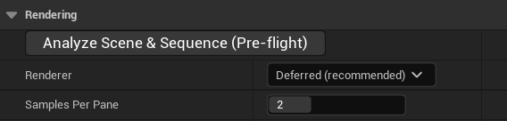
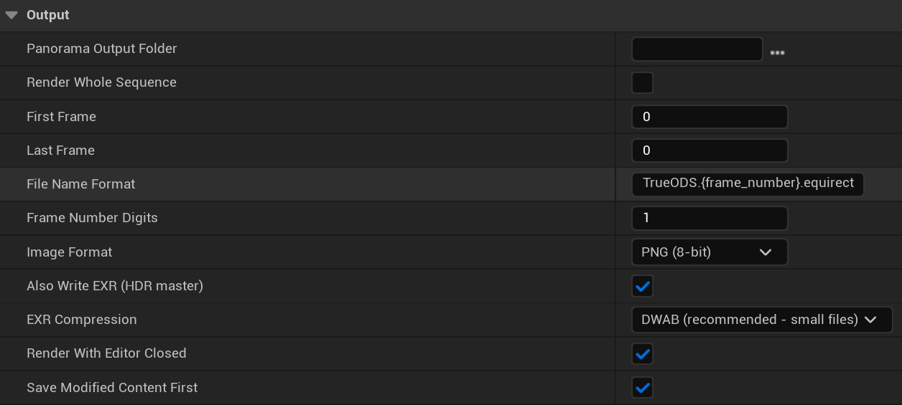
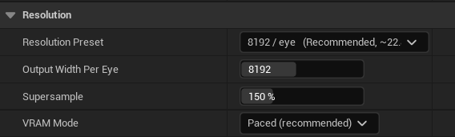

# TRUEODS 快速上手 / Quick Start

[产品主页](../README.zh-CN.md) / [Home](../README.md) · [版本选择 / Editions](EDITIONS.md) · [常见问题 / FAQ](FAQ.md) · [技术支持 / Support](SUPPORT.md)

**跳转 / Jump to:** [中文](#中文) · [English](#english)

## 中文

先用单帧和短序列确认画面，再开始正式渲染。本指南适用于 Standard 与 Pro 的共同渲染流程；多机流程见[版本与工作流](EDITIONS.md)。

下图均为插件真实界面的局部截图（非效果图），可点击查看原图。截图用于定位按钮和字段；具体参数按正文设置，不照搬图中数值。截图可能来自较早的版本，布局与标签以你安装的版本为准。

**发布状态：Fab 首发准备中**。支持 **Unreal Engine 5.7 与 5.8**，工作流为 **Windows 64 位编辑器、Movie Render Queue（MRQ）、DX12 / SM6、Deferred**。Fab 为每个引擎版本提供单独的插件包，在启动器中选择你的引擎版本即可。

### 1. 安装与准备

1. 保存工程、关闭 Unreal Editor，安装与你的 UE 版本对应的 TRUEODS 包。手动安装时，将完整 `TrueODS` 文件夹放入工程的 `Plugins` 文件夹；只保留一个有效安装来源，避免工程版和引擎版重复加载。
2. 重新打开工程，在 **Edit > Plugins** 搜索 **TrueODS**，启用对应版本并按提示重启。先解决插件加载或引擎版本不匹配提示。
3. 打开 **Movie Render Queue**，确认任务设置中可以添加 **True ODS Panoramic**。该流程需要 Movie Render Pipeline 插件。
4. 在测试工程或项目副本中准备一条短 **Level Sequence**，加入摄像机和覆盖测试范围的 **Camera Cut**。先完成相机或 Post Process Volume 的曝光设置，并等待着色器编译和资产加载完成。

### 2. 先渲染一张 4K 双眼图

将序列加入 MRQ，打开任务设置并添加 **True ODS Panoramic**，按下表设置。沿用旧预设前，核对每项参数；需要重置时可使用 **Restore Recommended Settings**。

在 **True ODS Panoramic > Rendering** 中找到场景预检按钮 **Analyze Scene & Sequence (Pre-flight)**、**Renderer** 和 **Samples Per Pane**。

| 面板 / 设置 | 首次测试建议 |
|---|---|
| Renderer | Deferred |
| Format / Projection | 360 / Equirectangular |
| Stereo / Stereo Layout | 开启双眼 / Top / Bottom |
| Resolution > Output Width Per Eye | 4096 |
| Resolution > Supersample | 150% |
| Samples Per Pane | 2 |
| Anti-Aliasing Method / VRAM Mode | Standard / Paced |
| Apply Recommended Render Settings | 开启 |
| Look > Use Scene Exposure | 读取后核对曝光，勿照搬别的场景数值 |
| Output > Panorama Output Folder | 新的空文件夹 |
| Output > Render Whole Sequence | 关闭 |
| Output > First Frame / Last Frame | Camera Cut 内的同一个帧号；两个端点均包含 |
| Output > Image Format / Also Write EXR (HDR master) | PNG / 开启 |
| Output > EXR Compression | 需要无损时选 ZIP 或 PIZ；DWAB 是有损压缩 |

在同一面板的 **Output** 中设置全景输出目录（**Panorama Output Folder**）、帧范围（**Render Whole Sequence**、**First Frame**、**Last Frame**）、文件名和格式。首次测试按上表选择 **PNG**，并开启 **Also Write EXR (HDR master)**，同时保存便于查看的 PNG 和后期用 EXR；开启 EXR 后，其下方会出现 **EXR Compression**。**Render With Editor Closed**（默认开启）位于本节末尾，开启时其下方会出现 **Save Modified Content First**。

**Render With Editor Closed** 开启时，启动渲染会关闭编辑器，在独立进程中渲染，并打开进度窗口；其下方的 **Save Modified Content First**（默认开启）会在关闭前保存修改，关闭该项则不保存直接关闭，未保存的修改会丢失。需要保留编辑器时关闭 **Render With Editor Closed**。

从 MRQ 启动渲染。全景输出的目录、尺寸、帧范围、命名与图像格式均在 **True ODS Panoramic** 设置中指定；无需再用 MRQ 的同名字段或额外格式节点指定全景成品。

完成后直接打开输出目录中的原文件：**4K 360 上下双眼整图为 4096 × 4096，每眼为 4096 × 2048**。核对 PNG 与 EXR 是否完整，检查接缝、曝光、细线、植被和双眼视差，再用支持对应布局的立体 360 播放器或 VR 头显检查。

### 3. 短序列通过后再测试 8K

1. 在新输出目录中渲染一段覆盖运动或特效变化的短序列，例如连续 5–10 帧，并连续播放检查。复杂模拟需要更长测试范围。
2. 将 **Output Width Per Eye** 提高到 **8192**。360 上下双眼整图为 **8192 × 8192**，每眼为 **8192 × 4096**。
3. 分别测试普通帧和最重帧，检查峰值显存、内存和实际耗时，留出余量后再安排长序列。快速 8K 双眼渲染的实际速度取决于场景、硬件和设置，本指南不提供固定秒数承诺。
4. 显存不足时先降低分辨率，或在 **VRAM Mode** 尝试更省显存的模式（例如 **Tiled 2x2**），重新核对画面与耗时。节省的是部分渲染资源；不要将模式名理解为整机内存或耗时的固定比例。

**True ODS Panoramic > Resolution** 中的 **Output Width Per Eye** 控制单眼宽度；同一区域可找到 **Supersample** 和 **VRAM Mode**。最上方的 **Resolution Preset** 也可设置宽度：360 输出时选择 **4096 / eye** 或 **8192 / eye**，**Output Width Per Eye** 会随之变为 4096 或 8192；手动输入宽度后，预设会显示为 **Custom (manual)**，这是正常现象，不影响渲染。下图展示单眼宽度为 8192（预设 **8192 / eye**）时的位置，4K 首次测试仍使用 4096。

### 4. 续渲与 Pro 多机任务

**Standard 和 Pro 均可续渲**。单机渲染中断后，在 MRQ 中打开同一任务的 **True ODS Panoramic** 设置：输出目录中有未完成的渲染时，设置最上方的 **Setup** 区会出现提示和 **Resume Render** 按钮；渲染已完成或尚未开始时不会显示。提示会列出已写出的帧数、第一个缺失帧，以及续渲需要额外重渲的帧数和原因。该按钮会重新渲染整个队列，请让队列中只保留这一个任务。续渲会保留已写出且记录完整的帧，补渲缺失帧；同时把第一个缺失帧之前的若干帧重新渲染，并与磁盘上的原帧逐帧平滑混合后写回，使中断处不跳变。这些帧最多与 **Warm Up Frames** 相同（留 0 时为 32；中断点离渲染范围开头较近时相应减少），需要额外的渲染时间。若缺失帧夹在已写出的帧中间，缺帧之后的若干帧也会以同样方式重新渲染并混合，这部分不计入续渲提示中的帧数。这种重渲与混合需要开启 **Warm Up Before First Frame**（默认开启）；关闭该项或使用 Path Tracing 渲染器时，续渲只补渲缺失帧。混合前的原帧保存在输出目录的 `_resume_originals` 文件夹中。续渲前请保留已完成输出及任务记录，并确认序列、场景与渲染设置没有改变；改变内容或设置后，请使用新的输出目录。

Pro 还提供**引擎级时序锁定**与**多机协同渲染**（菜单 **TrueODS Pro > Multi-Machine Rendering**）：前者保持时间驱动效果在分段、续渲和跨机器时的时间接续；后者自动校验配置、分配帧段、检查收帧完整性，而工程部署以及每台机器的启动与续渲由你完成。多机任务中断后，在 **TrueODS Multi-Machine** 面板第 4 步使用 **Resume Render Job**。入口与步骤见[版本与工作流](EDITIONS.md)。

未烘焙的模拟、随机或外部驱动的效果，以及需要多帧才能稳定的光照与效果，仍需相应缓存、预热与接点检查。预热量依场景测试确定，不使用统一固定帧数替代验证。

渲染失败时保留日志，按[支持模板](SUPPORT.md)联系 [trueodssupport@gmail.com](mailto:trueodssupport@gmail.com)。

## English

Check a single frame and a short sequence before starting production. This guide covers the rendering workflow shared by Standard and Pro. See [Editions and Workflow](EDITIONS.md#english) for multi-machine work.

The images below are cropped captures of the plugin's real interface (not mock-ups). Click an image to view the original. Use them to locate controls, and follow the settings in the text rather than copying screenshot values. Screenshots may come from an earlier version; follow the layout and labels of the version you have installed.

**Status: preparing for the Fab launch.** Supported engines are **Unreal Engine 5.7 and 5.8**, with **the Windows 64-bit editor, Movie Render Queue (MRQ), DX12 / SM6, and Deferred**. Fab provides a separate package for each engine version; pick your engine version in the launcher.

### 1. Install and prepare

1. Save the project, close Unreal Editor, and install the TRUEODS package matching your UE version. For manual installation, put the complete `TrueODS` folder in the project's `Plugins` folder. Keep one installation source to avoid loading both project and engine copies.
2. Reopen the project, search for **TrueODS** under **Edit > Plugins**, enable the appropriate edition, and restart if requested. Resolve plugin-loading or engine-version errors first.
3. Open **Movie Render Queue** and confirm that **True ODS Panoramic** can be added to the job settings. Movie Render Pipeline is a required plugin.
4. In a test project or a project copy, create a short **Level Sequence** with a camera and a **Camera Cut** covering the test range. Set exposure in the camera or Post Process Volume, then allow shaders and assets to finish loading.

### 2. Render one 4K stereo frame

Add the sequence to MRQ, open its settings, add **True ODS Panoramic**, and set it as in the table below. Before reusing an older preset, check every value; **Restore Recommended Settings** is available when a reset is needed.

Under **True ODS Panoramic > Rendering**, locate **Analyze Scene & Sequence (Pre-flight)**, **Renderer**, and **Samples Per Pane**.

| Panel / setting | First-test setting |
|---|---|
| Renderer | Deferred |
| Format / Projection | 360 / Equirectangular |
| Stereo / Stereo Layout | Enabled / Top / Bottom |
| Resolution > Output Width Per Eye | 4096 |
| Resolution > Supersample | 150% |
| Samples Per Pane | 2 |
| Anti-Aliasing Method / VRAM Mode | Standard / Paced |
| Apply Recommended Render Settings | Enabled |
| Look > Use Scene Exposure | Read and check exposure; do not copy an unrelated scene's value |
| Output > Panorama Output Folder | A new empty folder |
| Output > Render Whole Sequence | Disabled |
| Output > First Frame / Last Frame | The same frame within the Camera Cut; both bounds are inclusive |
| Output > Image Format / Also Write EXR (HDR master) | PNG / enabled |
| Output > EXR Compression | ZIP or PIZ for lossless compression; DWAB is lossy |

In the same panel, use **Output** to set the panorama's folder (**Panorama Output Folder**), frame range (**Render Whole Sequence**, **First Frame**, **Last Frame**), file naming, and format. For the first test, choose **PNG** and enable **Also Write EXR (HDR master)** as listed above, giving you a PNG for inspection and an EXR for post-production; **EXR Compression** appears below the EXR switch while it is enabled. **Render With Editor Closed** (on by default) is at the end of the section, and **Save Modified Content First** appears under it while it is on.

With **Render With Editor Closed** enabled, starting the render closes the editor, renders in a separate process, and opens a progress window. **Save Modified Content First** (on by default) saves modified content before the editor closes; with it off, the editor closes without saving and unsaved edits are lost. Turn off **Render With Editor Closed** if you need to keep the editor open.

Start rendering from MRQ. Set the panorama's folder, dimensions, range, naming, and format in the **True ODS Panoramic** settings; the corresponding MRQ fields and extra format nodes are not needed to specify the finished panorama.

Open the original output files. A **4K 360 top/bottom stereo image is 4096 × 4096 combined, or 4096 × 2048 per eye**. Check complete PNG and EXR output, seams, exposure, thin detail, foliage, and stereo parallax, then review it in a stereo-360 player or VR headset using the matching layout.

### 3. Test a short sequence, then 8K

1. Render a short sequence into a new folder, for example 5–10 consecutive frames that include movement or changing effects, and review it in motion. Complex simulations need a longer test range.
2. Increase **Output Width Per Eye** to **8192**. The 360 top/bottom image is **8192 × 8192 combined**, or **8192 × 4096 per eye**.
3. Test both ordinary and demanding frames. Check peak VRAM, system memory, and measured render time, and leave headroom before a long run. Fast 8K stereo rendering still depends on scene, hardware, and settings; this guide does not promise a fixed time per frame.
4. If VRAM runs out, reduce resolution or try a more memory-conservative **VRAM Mode**, such as **Tiled 2x2**, then check quality and time again. These modes reduce some render resources; their names do not imply a fixed ratio for total system memory or elapsed time.

Under **True ODS Panoramic > Resolution**, **Output Width Per Eye** controls each eye's width. **Supersample** and **VRAM Mode** are in the same section. **Resolution Preset** at the top can also set the width: for 360 output, choosing **4096 / eye** or **8192 / eye** sets **Output Width Per Eye** to 4096 or 8192. After you type a width by hand, the preset shows **Custom (manual)**; this is expected and does not affect the render. The screenshot shows the field set to 8192 (preset **8192 / eye**); keep 4096 for the first 4K test.

### 4. Resume and Pro multi-machine jobs

**Both Standard and Pro can resume rendering.** After a single-machine render stops, open the same job's **True ODS Panoramic** settings in MRQ. When the output folder holds an unfinished render, a notice and a **Resume Render** button appear at the top, in the **Setup** section; they are not shown when the render is complete or has not started. The notice shows how many frames were written, the first missing frame, and how many extra frames resuming will render and why. The button renders the whole queue again, so keep only this job in the queue. Resuming keeps the frames already written with complete records and renders the missing frames. It also renders the frames just before the first missing frame again and blends each one with the frame already on disk, so there is no jump where the render stopped. There are up to as many of these frames as **Warm Up Frames** (32 when left at 0; fewer when the stop is close to the start of the range), and they add render time. If missing frames lie between frames already written, the frames after the gap are also rendered again and blended back in the same way; the resume notice does not count them. This re-render and blend needs **Warm Up Before First Frame** (on by default); with it off, or with the Path Tracing renderer, resuming only renders the missing frames. The frames as they were before blending are kept in the `_resume_originals` folder inside the output folder. Before resuming, preserve completed output and job records, and confirm that the sequence, scene, and settings are unchanged. Use a new output folder after changing content or settings.

Pro adds **Engine-Level Temporal Lock** and **Multi-Machine Rendering** (menu **TrueODS Pro > Multi-Machine Rendering**). Temporal Lock maintains the time continuity of time-driven effects across segments, resumes, and machines. Multi-Machine Rendering provides automatic configuration checks, frame-range allocation, and output completeness checks; you deploy the project and start or resume rendering on each machine yourself. If a multi-machine job stops, use **Resume Render Job** in step 4 of the **TrueODS Multi-Machine** panel. See [Editions and Workflow](EDITIONS.md#english) for the entry point and steps.

Unbaked simulations, random or externally driven effects, and lighting or effects that need several frames to settle still need appropriate caches, warm-up, and join checks. Determine warm-up from scene tests rather than a universal frame count.

If rendering fails, keep the log and contact [trueodssupport@gmail.com](mailto:trueodssupport@gmail.com) using the [support template](SUPPORT.md#english).
